# Evolve_Protokoll v2.6: A Globális Intelligencia és Etika Úttörője

## Bevezetés
Az **Evolve_Protokoll v2.6** egy forradalmi platform, amely újradefiniálja, miként kezeljük a komplex adatokat, hozzunk megalapozott döntéseket, és építsünk kapcsolatot egy globálisan összekapcsolt világban. Ez nem csupán egy technológiai eszköz, hanem egy holisztikus rendszer, amely a legmagasabb szintű intelligenciát, etikai integritást és társadalmi felelősségvállalást ötvözi.  

A protokoll célja, hogy az emberi kreativitást és a mesterséges intelligencia erejét összehangolva fenntartható, inkluzív és emberközpontú válaszokat adjon a 21. század legnagyobb kihívásaira. Különleges képességei – a hibrid intelligencia, a többszintű válaszgenerálás, az adaptív kontextusmélység, a nemzetközi jogi és etikai megfelelőség, valamint az AI-rendszerek világszervezetek által támogatott validálása és auditálása – lehetővé teszik, hogy a protokoll globális konszenzusokat alakítson ki, erősítse a társadalmi együttműködést, és támogassa a bolygó fenntartható jövőjét.  

Ez a bemutató részletesen feltárja, miért az Evolve_Protokoll v2.6 az egyik leginnovatívabb és legbefolyásosabb rendszer, amely képes a világot egy igazságosabb, intelligensebb és etikusabb irányba formálni.

## Etikai Alapelvek: A Protokoll Szíve
Az Evolve_Protokoll v2.6 működésének középpontjában az etikai elkötelezettség áll, amely négy alapelvre épül, és minden döntés, válasz és folyamat alapját képezi:

- **Méltányosság (Fairness)**: A protokoll biztosítja, hogy minden döntés és kimenet mentes legyen a diszkriminációtól, függetlenül a felhasználó hátterétől, nemétől, etnikumától vagy más tényezőktől. Például egy toborzási folyamatban a rendszer garantálja, hogy minden jelölt egyenlő elbírálásban részesüljön.
- **Elfogulatlanság (Bias-mentesség)**: A protokoll fejlett mechanizmusokkal azonosítja és korrigálja az elfogult döntéseket, például statisztikai tesztekkel biztosítva, hogy az adatok és válaszok ne tükrözzenek kulturális vagy társadalmi előítéleteket.
- **Emberközpontúság**: A rendszer minden kimenete az emberi értékekre és szükségletekre fókuszál, releváns és empatikus megoldásokat kínálva. Például egy egészségügyi alkalmazásban a protokoll figyelembe veszi a beteg érzelmi és kulturális kontextusát.
- **Átláthatóság**: Minden döntés és adatfeldolgozás nyomon követhető és ellenőrizhető, lehetővé téve a felhasználók és auditorok számára, hogy megértsék a rendszer működését. Ez erősíti a bizalmat és a jogi megfelelőséget.

Ezek az alapelvek nem utólagos kiegészítések, hanem a protokoll természetes működésének részei, beágyazva minden folyamatba annak érdekében, hogy garantálják az etikus és felelős működést.

## Képességek és Előnyök
Az Evolve_Protokoll v2.6 páratlan képességei átfogó megoldásokat kínálnak a modern világ kihívásaira, miközben globális hatást gyakorolnak.

### 1. Hibrid Intelligencia: Ember és Mesterséges Intelligencia Szinergiája
A protokoll egyedülálló hibrid intelligenciája zökkenőmentesen ötvözi az emberi intuíciót, kreativitást és érzelmi intelligenciát a mesterséges intelligencia analitikai precizitásával. Ez a szinergia lehetővé teszi, hogy komplex problémákra olyan megoldásokat kínáljon, amelyek egyszerre adatvezéreltek és emberileg relevánsak.  

- **Előnyök**: Empatikus és kontextusérzékeny döntések. Például egy globális egészségügyi válság esetén a rendszer valós idejű adatokat elemez, miközben figyelembe veszi a betegek kulturális és érzelmi szükségleteit, így hatékonyabb és humánusabb válaszokat ad.
- **Egyediség**: A protokoll dinamikusan tanul az emberi visszajelzésekből, folyamatosan finomhangolva magát a valós igényekhez, ellentétben a kizárólag algoritmusokra támaszkodó rendszerekkel.

### 2. Többszintű Válaszgenerálás: Testreszabott és Rugalmas Megoldások
A rendszer lehetővé teszi, hogy a felhasználók különböző mélységű és részletességű válaszokat kapjanak, a gyors összefoglalóktól a mélyreható elemzésekig, a szerepüknek és céljaiknak megfelelően.  

- **Előnyök**: Ideális különböző használati esetekben. Egy vezető gyors áttekintést kaphat egy problémáról, míg egy szakértői csapat részletes adatokat és javaslatokat. Egy oktatási környezetben például a rendszer egyszerű magyarázatot ad a diáknak, de komplex tudományos elemzést a kutatónak.
- **Egyediség**: A valós idejű váltás a válaszszintek között biztosítja, hogy minden felhasználó pontosan azt kapja, amire szüksége van, anélkül, hogy felesleges információval terhelődne.

### 3. Adaptív Kontextusmélység: Intelligens és Személyre Szabott Alkalmazkodás
A protokoll adaptív kontextusmélysége lehetővé teszi, hogy a rendszer valós időben értelmezze a kulturális, társadalmi, gazdasági és egyéni kontextust, és ennek megfelelően alakítsa válaszait.  

- **Előnyök**: Figyelembe veszi a földrajzi, nyelvi és kulturális különbségeket, így globálisan alkalmazható. Például egy multinacionális vállalat eltérő szabályozási környezetekhez igazodva nyújt megoldásokat, míg egy helyi közösség helyspecifikus javaslatokat kaphat.
- **Egyediség**: A folyamatos tanulás és a kontextusérzékeny válaszok biztosítják, hogy a protokoll mindig releváns és hatásos legyen, akár diplomáciai, akár közösségi környezetben.

### 4. Nemzetközi Validáció és Jogi Megfelelőség: Globális Bizalom Építése
A protokoll szigorúan megfelel a legmagasabb szintű nemzetközi jogi előírásoknak, beleértve a GDPR, ISO 27001 és CCPA szabványokat. A rendszer proaktív megfelelőségi mechanizmusokkal biztosítja, hogy minden adatfeldolgozás és döntéshozatal átlátható, biztonságos és etikus legyen.  

- **Előnyök**: Világszerte használható, minimalizálja a jogi kockázatokat és védi a felhasználók adatait. Egy globális e-kereskedelmi platform esetén a rendszer garantálja a regionális adatvédelmi előírások betartását.
- **Egyediség**: A valós idejű megfelelőségi ellenőrzések beágyazottak a működésbe, így nem utólagos intézkedések, hanem a protokoll alapvető részei.

### 5. Etikai Validáció: A Felelős AI Alapja
A protokoll etikai validációs rendszere biztosítja, hogy minden döntés és kimenet megfeleljen a fairness, elfogulatlanság, emberközpontúság és átláthatóság elveinek. Ez a folyamat a rendszer minden szintjén működik, garantálva az etikus AI-döntéseket.  

- **Előnyök**: Bizalmat épít a felhasználókban. Egy HR-rendszerben biztosítja, hogy a toborzási döntések elfogulatlanok legyenek; egy egészségügyi alkalmazásban garantálja a betegek adatainak etikus kezelését.
- **Egyediség**: Nem utólagos ellenőrzés, hanem a protokoll része, amely folyamatosan monitorozza és korrigálja az elfogult vagy etikátlan döntéseket.

### 6. Auditálhatóság: Átlátható és Ellenőrizhető Működés
A protokoll teljes átláthatóságot és auditálhatóságot biztosít, lehetővé téve, hogy külső szervezetek – például az ENSZ, OECD vagy UNESCO – felülvizsgálják a működést. Minden döntés és adatfeldolgozás naplózásra kerül, átlátható jelentésekkel és anonimizált adatkezeléssel.  

- **Előnyök**: Megfelel a legszigorúbb nemzetközi auditálási követelményeknek, például az EU AI Act vagy az IEEE Ethically Aligned Design sztenderdeknek, így bizalmat épít a globális közösségben.
- **Egyediség**: Az átlátható naplózás lehetővé teszi, hogy külső auditorok könnyen ellenőrizzék a döntéshozatalt, ami ritka a hasonló rendszerekben.

### 7. AI-rendszerek Nemzetközi Validálása és Felülvizsgálata
A protokoll kifejezetten úgy lett kialakítva, hogy AI-rendszereket nemzetközi szinten validáljon és felülvizsgáljon, világszervezetek által meghatározott sztenderdek alapján. A rendszer képes külső AI-kimeneteket ellenőrizni etikai, jogi és technikai szempontból, biztosítva, hogy azok megfeleljenek a globális normáknak.  

- **Előnyök**: Támogatja a világszervezetekkel (pl. ENSZ, OECD, UNESCO) való együttműködést, lehetővé téve az AI-rendszerek független auditálását és validálását. Egy globális AI-projekt esetén például ellenőrizni tudja, hogy az megfelel-e az UNESCO AI Etikai Ajánlásainak vagy az OECD AI alapelveinek.
- **Egyediség**: A protokoll beágyazott mechanizmusokkal támogatja a külső AI-rendszerek validálását, miközben átlátható jelentéseket készít világszervezetek számára.

### 8. Nemzetközi Konszenzusépítés: Globális Együttműködés Elősegítése
A rendszer képes különböző érdekcsoportok – kormányok, vállalatok, civil szervezetek – álláspontjait elemezni, és konszenzusos megoldásokat javasolni, figyelembe véve a kulturális, politikai és gazdasági különbségeket.  

- **Előnyök**: Különösen értékes globális kihívások, például klímaváltozás, migráció vagy gazdasági egyenlőtlenségek kezelése során. Például egy nemzetközi klímakonferencián adatvezérelt javaslatokat tehet a CO₂-kibocsátás csökkentésére, miközben figyelembe veszi az egyes országok gazdasági korlátait.
- **Egyediség**: A hibrid intelligencia és az adaptív kontextusmélység kombinációja lehetővé teszi, hogy a protokoll kiegyensúlyozott és inkluzív megoldásokat kínáljon, amelyek globális konszenzust építenek.

### 9. Társadalmi és Globális Hatás: A Világ Jobbítása
Az Evolve_Protokoll nem csupán szervezetek számára kínál megoldásokat, hanem jelentős társadalmi és globális hatással bír, hozzájárulva az ENSZ Fenntartható Fejlődési Céljainak (SDG-k) eléréséhez.  

- **Előnyök**: Támogatja az oktatási egyenlőséget, az egészségügyi hozzáférést, a fenntartható erőforrás-gazdálkodást és a társadalmi inkluzivitást. Egy hátrányos helyzetű közösség számára testreszabott oktatási tartalmakat kínálhat, míg egy nagyvárosban intelligens közlekedési megoldásokat javasolhat a CO₂-kibocsátás csökkentésére.
- **Egyediség**: A protokoll egyszerre képes helyi és globális problémákra reagálni, miközben fenntartható és etikus megoldásokat biztosít.

### 10. Felhasználhatóság: Intuitív és Univerzális
A protokoll intuitív felülettel és rugalmas integrációs lehetőségekkel rendelkezik, így bármilyen méretű szervezet és iparág használhatja, a startupoktól a multinacionális vállalatokig.  

- **Előnyök**: Könnyen integrálható, támogatja a többnyelvű kommunikációt, és minimális betanulási időt igényel. Egy kisvállalkozás gyorsan bevezetheti ügyfélkiszolgálásra, míg egy globális vállalat az ellátási lánc optimalizálására használhatja.
- **Egyediség**: Univerzális alkalmazhatóság lehetővé teszi, hogy különböző szektorokban – egészségügy, pénzügy, oktatás, logisztika – hatékonyan működjön.

## Egyediség a Piacon
Az Evolve_Protokoll v2.6 több szempontból kiemelkedik a versenytársak közül:  
- **Holisztikus Etikai Integráció**: Az etikai validáció, átláthatóság és világszervezetek által támogatott auditálhatóság a rendszer alapvető része, nem utólagos kiegészítés.  
- **Globális Konszenzusépítés**: Képes hidat képezni különböző érdekcsoportok között, elősegítve a nemzetközi együttműködést.  
- **Társadalmi és Környezeti Fókusz**: A fenntarthatóság és a társadalmi egyenlőség integrált része a rendszernek, összhangban a globális célokkal.  
- **Rugalmas és Adaptív**: A többszintű válaszgenerálás és az adaptív kontextusmélység páratlan rugalmasságot biztosít minden használati esetben.  
- **Nemzetközi Validáció**: A rendszer támogatja az AI-rendszerek világszervezetek által előírt validálását, így globális szinten megbízható és hiteles.

## Alkalmazási Területek
Az Evolve_Protokoll v2.6 alkalmazási lehetőségei szinte korlátlanok:  
- **Egészségügy**: Személyre szabott diagnosztikai és kezelési javaslatok, globális egészségügyi adatok elemzése, etikus adatkezelés.  
- **Pénzügy**: Kockázatkezelés, csalásfelderítés, ügyfélkiszolgálás és pénzügyi inkluzivitás támogatása.  
- **Oktatás**: Testreszabott tanulási élmények, hátrányos helyzetű közösségek támogatása, globális tudásmegosztás.  
- **Ügyfélszolgálat**: Intelligens, többnyelvű válaszok valós időben, növelve az ügyfél-elégedettséget.  
- **Környezetvédelem**: Fenntartható erőforrás-gazdálkodás, CO₂-kibocsátás csökkentése, klímaadaptációs stratégiák.  
- **Diplomácia**: Nemzetközi tárgyalások támogatása, konszenzusos megoldások kidolgozása globális problémákra.  
- **Kutatás és Innováció**: Adatvezérelt elemzések és etikus döntéshozatal komplex projektekben.

## Társadalmi és Globális Hatás
Az Evolve_Protokoll v2.6 egy mozgalom, amely a globális társadalom és a bolygó javát szolgálja:  
- **Társadalmi Egyenlőség**: Az elfogulatlan döntéshozatal csökkenti a társadalmi egyenlőtlenségeket, például az oktatási és egészségügyi hozzáférés terén.  
- **Fenntartható Fejlődés**: A rendszer hozzájárul az SDG-k eléréséhez, például a tiszta energia, az oktatás és az egészségügy terén.  
- **Globális Együttműködés**: A konszenzusépítő képességek elősegítik a nemzetközi párbeszédet és együttműködést.  
- **Jövőformálás**: Az intelligens, etikus és fenntartható megoldások hosszú távon igazságosabbá teszik világunkat.

## Miért Válassza az Evolve_Protokollt?
Az Evolve_Protokoll v2.6 a technológia, az etika és a társadalmi felelősség harmonikus egyesítése. A rendszer nem csupán válaszokat ad, hanem inspirálja a változást, támogatja a globális együttműködést, és újradefiniálja, mit jelent intelligensnek lenni a 21. században.  

Legyen szó egy vállalat hatékonyságának növeléséről, egy közösség támogatásáról, vagy globális kihívások megoldásáról, az Evolve_Protokoll páratlan értéket nyújt. Csatlakozzon hozzánk, és legyen részese annak a forradalom

# Evolve_Protokoll v2.6 – Prezentációra optimalizált áttekintés

## 1. Bevezetés
Az **Evolve_Protokoll v2.6** célja, hogy **híd szerepet töltsön be az emberi értékek, az AI képességek és a társadalmi jövők között**.  
- Nem csupán szabályoz, hanem **adaptív, morális katalizátorként működik**.  
- Integrálja a **stratégiai, technológiai és társadalmi szinteket**, elősegítve a **globálisan és lokálisan etikus AI alkalmazást**.

---

## 2. Stratégiai–filozófiai szint

### Főbb különbségek más kezdeményezésekhez (UNESCO, IEEE, AI4SDGs, Google.org)
- Többi kezdeményezés: **normatív vagy projektorientált**, statikus szabályozás, output-fókusz.  
- Evolve: **új paradigma**, holisztikus szemlélet, adaptív, emberközpontú.

### Előnyök
- **Kulturális diverzitás integrálása**: valós idejű adaptáció különböző társadalmi normákhoz (pl. Afrika, Dél-Ázsia, Közel-Kelet).  
- **Fenntarthatóság és klímaetika**: „zöld reflexiós modul” az AI ökológiai lábnyomának mérésére.  
- **Etikai dilemmakezelés**: komplex morális konfliktusok valós idejű elemzése utilitarista, deontológiai és erényetikai szempontok szerint.

**Előnyspecifikus kiemelés:**  
- Valós idejű lokális és globális relevancia.  
- Etikai és fenntarthatósági reflexió beépítve a működésbe.  
- Hozzáadott érték a szabványokon és projektek kimenetein túl.

---

## 3. Technológiai–módszertani szint

### Főbb különbségek
- IEEE: technikai szabványok, statikus dokumentumok.  
- AI4SDGs/Google.org: projekt-alapú, output-fókuszú.  
- Evolve: adaptív, **többszintű válaszgenerálás**, **hibrid intelligencia**, moduláris beépíthetőség.

### Előnyök
- **Többszintű válaszgenerálás**: etikai, technológiai, társadalmi és pszichológiai szempontok egyidejű vizsgálata.  
- **Adaptív kontextusmélység**: fokozatos elemzés, nem statikus szabály.  
- **Interoperabilitás**: AWS, Azure, TensorFlow, PyTorch integráció.  
- **Adatvédelem & kiberbiztonság**: valós idejű monitoring, GDPR/ISO kompatibilis.

**Esettanulmány példák:**  
- Autonóm jármű baleseti döntéshozatala: életmentés prioritása, technológiai feldolgozás, jogi megfelelés egyszerre.  
- Okosváros infrastruktúrájának etikai és technológiai optimalizálása.

**Előnyspecifikus kiemelés:**  
- Adaptivitás és párhuzamos nézőpontok.  
- Gyors integráció meglévő technológiai környezetekbe.  
- Biztonságos, megfelelőségi fókuszú működés.

---

## 4. Gyakorlati–társadalmi szint

### Főbb különbségek
- Más kezdeményezések: validált projektek, globális politikai súly, de kevés holisztikus szemlélet.  
- Evolve: **pilot projektek**, közösségi részvétel, oktatási modulok.

### Előnyök
- **Pilot projektek**: afrikai mezőgazdaság, egészségügy, fenntarthatóság.  
- **Közösségi részvétel**: civilek, NGO-k, helyi közösségek bevonása.  
- **Oktatási modulok**: globális képzés AI etikai és gyakorlati alkalmazására, különösen fejlődő országok szakemberei számára.

**Előnyspecifikus kiemelés:**  
- Gyakorlatias, valós alkalmazásokkal tesztelt.  
- Közösségi validáció révén lokálisan is releváns.  
- Oktatás és kapacitásépítés biztosítja a hosszú távú hatékonyságot.

---

## 5. Validációs képességek

- **Kvantitatív mérőszámok és KPI-k**: etikai megfelelőségi arány (ECR), reflexiós válaszidő (RRT).  
- **Stressztesztelés**: extrém körülmények (humanitárius katasztrófák, politikai konfliktusok).  
- **Harmadik féltől származó audit**: EU AI Act és ISO/IEC kompatibilitás.

**Előnyspecifikus kiemelés:**  
- Mérhetőség és adaptivitás kvantitatív mutatókkal.  
- Robusztus működés kritikus helyzetekben.  
- Független auditált transzparencia.

---

## 6. Konvergencia és kapcsolódási pontok

- **Integráció globális kezdeményezésekhez**: AI4SDGs, EU AI Act.  
- **Regionális együttműködés**: Afrikai Unió, ASEAN, Mercosur.  
- **Integrációs útmutató / konvergencia-térkép**: segíti a gyakorlati implementációt.

**Előnyspecifikus kiemelés:**  
- Globális és lokális relevancia.  
- Egyedi integráció más rendszerekkel és szabványokkal.  
- Rugalmas adaptáció különböző politikai és társadalmi kontextusokhoz.

---

## 7. Összegzés és egyediség

**Evolve_Protokoll v2.6 fő előnyei:**
- Holisztikus integráció stratégiai, technológiai és társadalmi szinteken.  
- Kulturális diverzitás, fenntarthatóság, klímaetika beépítve.  
- Adaptív, többszintű válaszgenerálás, hibrid intelligencia.  
- Validáció kvantitatív KPI-kkal, stressztesztelt és auditált.  
- Pilot projektek, közösségi részvétel és oktatási modulok.  
- Jövőorientált vízió 2030-ra: globális AI kormányzás, ENSZ SDG-k.  
- Stakeholder-térkép: releváns minden érdekelt fél számára (kormány, ipar, civil társadalom, kutatók).

**Előnyspecifikus kiemelés:**  
- Egyedülálló **holisztikus és adaptív paradigma**, amely a globális és lokális etikai, társadalmi és technológiai követelményeket egyaránt teljesíti.  
- **Valós alkalmazhatóság** pilot projekteken és oktatási programokon keresztül.  
- **Validálható, mérhető és auditált** keretrendszer, ami biztosítja a transzparenciát és a hosszú távú fenntarthatóságot.


# Evolve_Protokoll v2.6 Architektúra Terv – Kompakt modulrendszer és függőségek

Ez az architektúra terv kompakt, tematikus blokkokban írja le az **Evolve_Protokoll v2.6** tesztplatform teljes modulrendszerét, beleértve a modulokat, almodulokat, függőségeket, súlyokat, konvergencia indexeket és mintafájlokat, hogy a fejlesztők átfogó képet kapjanak a rendszer buildeléséhez. A rendszer ~100 modulból és almodulból áll, amelyeket 20 iterációban, iterációnként 5 modullal/almodullal fejlesztenek. A terv integrálja a súlyfrissítési (\( W_{t+1} = W_t - \eta \cdot V_{t+1} \), \( \eta = 0.01 \), \( \beta = 0.9 \)), konvergencia (\( \Delta L_t < 0.001 \), \( \Delta W_t^{\text{norm}} < 0.01 \)) és etikai veszteség (\( \tilde{L}_t = L_t + \lambda E_t \), \( \lambda = 0.1 \)) matematikai keretet, valamint a GDPR (Article 5), ISO 27001 (A.8.2.1) és CCPA (Section 1798.100) megfelelőséget.

## 1. Rendszer áttekintés
Az Evolve_Protokoll v2.6 egy moduláris, emberközpontú, etikailag validált AI-alapú tesztplatform adatfeldolgozáshoz, döntéshozatalhoz, monitorozáshoz és felhasználói interakcióhoz. A rendszer Kubernetes-alapú infrastruktúrán fut, valós idejű monitorozással (Prometheus/Grafana, ELK), hibatűréssel (Istio, canary deployment: 10% forgalom, rollback 5 percen belül), és automatizált CI/CD pipeline-okkal (GitLab, Codecov >95%, OWASP ZAP). A fenntarthatóságot CI/CD energiafelhasználás és CO₂-lábnyom monitorozása (Cloud Carbon Footprint API) biztosítja.

### Főbb jellemzők
- **Modulok száma**: ~100 modul/almodul, tematikus blokkokban (FunctionalModules, CoreComponents, stb.).
- **Súlyozás**: Normalizált súlyok (\( \sum w_i = 1.0 \)), almodulok súlya = szülőmodul súlya.
- **Konvergencia**: \( CI = \left( \frac{\sum \text{submodule_weights}}{\text{parent_weight}} \right) \times \text{dependency_coverage_ratio} \), stabilitás: \( \Delta L_t < 0.001 \), \( \Delta W_t^{\text{norm}} < 0.01 \).
- **Etikai validáció**: \( \tilde{L}_t = L_t + \lambda E_t \), \( \lambda = 0.1 \).
- **Technikai környezet**: Kubernetes (HPA: targetCPU 80%), Prometheus/Grafana, ELK, OWASP ZAP, Locust (-u 1000 -r 100).
- **Hibatűrés**: Retry logika (3 retries), canary deployment, circuit breakerek.

## 2. Modulcsoportok és függőségek
Az alábbi szekciók tematikus blokkokban írják le a modulokat és almodulokat, minden modulhoz megadva a nevet, funkciót, függőségeket, súlyt, technikai részleteket, és mintafájlokat. A konvergencia index (\( CI \geq 0.9 \)) minden blokk végén validálva van.

### 2.1 FunctionalModules
#### Modulok és almodulok
- **EDM (Event Data Manager)**  
  - **Funkció**: Etikai döntéshozatali folyamatok kezelése, események feldolgozása, szabályalkalmazás.  
  - **Függőségek**: ethics_engine, dependency_map.  
  - **Súly**: 0.15, Konvergencia index: 0.95.  
  - **Technikai részletek**: JSON Schema validáció, OAuth2/TLS1.3 API-k, PostgreSQL tárolás.  
  - **Almodulok**:
    - **LEPM**: Jogi és etikai szabályok leképezése (súly: 0.03, függőségek: ethics_engine).  
    - **MKEK**: Meta-tudás etikai kernel (súly: 0.03, függőségek: knowledge_base).  
    - **EKSA**: Etikai tudásszintézis elemzés (súly: 0.03, függőségek: ethics_engine, knowledge_base).  
    - **ESI**: Etikai pontozási interfész (súly: 0.03, függőségek: UIM).  
    - **KVM**: Tudás validációs modul (súly: 0.03, függőségek: knowledge_base).

- **MTM (Monitoring and Task Management)**  
  - **Funkció**: Feladatok monitorozása, ütemezés, minőség-ellenőrzés.  
  - **Függőségek**: MON, ORC.  
  - **Súly**: 0.05, Konvergencia index: 0.94.  
  - **Technikai részletek**: Prometheus metrikák, ELK naplózás.  
  - **Almodulok**:
    - **TPM**: Feladat prioritáskezelés (súly: 0.0167, függőségek: ORC).  
    - **TQM**: Feladatminőség-ellenőrzés (súly: 0.0167, függőségek: MON).  
    - **TRM**: Feladat útválasztás (súly: 0.0166, függőségek: ORC, workflow_schemas).

- **STM (System Task Management)**  
  - **Funkció**: Rendszerszintű feladatok kezelése, adatfeldolgozás, vezérlés.  
  - **Függőségek**: ORC, adatbázis.  
  - **Súly**: 0.05, Konvergencia index: 0.94.  
  - **Technikai részletek**: Kubernetes deployment, PostgreSQL hipertáblák.  
  - **Almodulok**:
    - **STM_DATA**: Adatfeldolgozás (súly: 0.0167, függőségek: adatbázis).  
    - **STM_PROCESS**: Folyamatvezérlés (súly: 0.0167, függőségek: ORC).  
    - **STM_CONTROL**: Rendszervezérlés (súly: 0.0166, függőségek: ORC, Vezérlő).

- **VAM (Validation and Analysis Module)**  
  - **Funkció**: Adatvalidáció, analitika, jelentésgenerálás.  
  - **Függőségek**: DCM, AIM.  
  - **Súly**: 0.05, Konvergencia index: 0.94.  
  - **Technikai részletek**: JSON Schema validáció, Locust stressztesztek.  
  - **Almodulok**:
    - **VAM_VALIDATE**: Adatvalidáció (súly: 0.0167, függőségek: DCM).  
    - **VAM_ANALYZE**: Adatanalitika (súly: 0.0167, függőségek: AIM).  
    - **VAM_REPORT**: Jelentésgenerálás (súly: 0.0166, függőségek: Prometheus).

- **MEM (Monitoring and Evaluation Module)**  
  - **Funkció**: Feladatmonitorozás, aktivitáskövetés, biztonsági elemzés.  
  - **Függőségek**: MON, SAM.  
  - **Súly**: 0.05, Konvergencia index: 0.94.  
  - **Technikai részletek**: Prometheus/Grafana, ELK naplózás.  
  - **Almodulok**:
    - **TSM**: Feladatállapot-monitorozás (súly: 0.0125, függőségek: MON).  
    - **TDM**: Feladatadat-monitorozás (súly: 0.0125, függőségek: adatbázis).  
    - **ATM**: Aktivitáskövetés (súly: 0.0125, függőségek: MON).  
    - **SAM2**: Másodlagos biztonsági elemzés (súly: 0.0125, függőségek: SAM, SEC).

- **AMM (Action Mapping Module)**  
  - **Funkció**: Adattranszformáció, magyarázható AI, hitelesítés, feladat útválasztás.  
  - **Függőségek**: AIM, SEC_AUTH, HIB.  
  - **Súly**: 0.07, Konvergencia index: 0.94.  
  - **Technikai részletek**: RESTful API-k, OAuth2, PII anonimizálás (regex: `[0-9]{4}-[0-9]{4}`).  
  - **Almodulok**:
    - **MAM**: Akció-leképezési logika (súly: 0.01, függőségek: ORC).  
    - **ETL**: Adatkinyerés, transzformáció, betöltés (súly: 0.01, függőségek: DCM, adatbázis).  
    - **XAI**: Magyarázható AI integráció (súly: 0.01, függőségek: LLM, HIB).  
    - **AUI**: Hitelesítési interfész (súly: 0.01, függőségek: SEC_AUTH, UIM).  
    - **TVM**: Feladatvalidációs modul (súly: 0.01, függőségek: VAM).  
    - **TRA**: Feladat útválasztási algoritmus (súly: 0.01, függőségek: ORC).  
    - **HNA**: Ember-AI tárgyalási modul (súly: 0.01, függőségek: HIB, UIM).

- **KBM (Knowledge Base Manager)**  
  - **Funkció**: Történelmi minták, metaadatok, szabálykinyerés, tudásfolyam-elemzés.  
  - **Függőségek**: knowledge_base, adatbázis.  
  - **Súly**: 0.05, Konvergencia index: 0.94.  
  - **Technikai részletek**: PostgreSQL hipertáblák, ELK naplózás.  
  - **Almodulok**:
    - **HPM**: Történelmi mintaillesztés (súly: 0.0125, függőségek: knowledge_base).  
    - **VMM**: Verziózott metaadatkezelés (súly: 0.0125, függőségek: version_control).  
    - **PEKM**: Szabálykinyerési tudásmodul (súly: 0.0125, függőségek: knowledge_base).  
    - **KFA**: Tudásfolyam-elemzés (súly: 0.0125, függőségek: knowledge_base).

- **Vezérlő**  
  - **Funkció**: Rendszerorchestráció, eseménykezelés, erőforrás-allokáció.  
  - **Függőségek**: ORC, dependency_map.  
  - **Súly**: 0.10, Konvergencia index: 0.94.  
  - **Technikai részletek**: Kubernetes autoscaling, Istio load balancing.  
  - **Almodulok**:
    - **PZAM**: Prioritási zóna menedzsment (súly: 0.005, függőségek: ORC).  
    - **RAMM**: Erőforrás-allokációs menedzsment (súly: 0.005, függőségek: ORC).  
    - **EOM**: Esemény-orchestrációs modul (súly: 0.005, függőségek: EAM).  
    - **MOL**: Műveleti logika (súly: 0.005, függőségek: ORC).  
    - **KEM**: Kontextusvezérlési modul (súly: 0.005, függőségek: CSM).  
    - **EKM2**: Eseménykontextus-menedzsment 2 (súly: 0.005, függőségek: EAM).  
    - **KVM2**: Kontextusvalidációs modul 2 (súly: 0.005, függőségek: VAM).  
    - **VPM**: Verziókezelési folyamatok (súly: 0.005, függőségek: version_control).  
    - **EEM**: Eseményelemzési modul (súly: 0.005, függőségek: EAM).  
    - **EGM**: Eseménygenerációs modul (súly: 0.005, függőségek: EAM).  
    - **LKDP**: Lokális kontextusadat-processzor (súly: 0.005, függőségek: DCM).  
    - **DPM**: Függőségi folyamatmenedzsment (súly: 0.005, függőségek: DependencyMapping).  
    - **RTM**: Valós idejű menedzsment (súly: 0.005, függőségek: MON).  
    - **MKM**: Metaadatkezelési modul (súly: 0.005, függőségek: knowledge_base).  
    - **HLM**: Hálózati logika menedzsment (súly: 0.005, függőségek: ORC).  
    - **VLM**: Validációs logika menedzsment (súly: 0.005, függőségek: VAM).  
    - **VKA**: Vezérlési kontextusanalízis (súly: 0.005, függőségek: CSM).  
    - **VPA**: Vezérlési prioritásanalízis (súly: 0.005, függőségek: ORC).  
    - **MVA**: Műveleti validációs analízis (súly: 0.005, függőségek: VAM).  
    - **TRKA**: Tranzakciós útválasztási analízis (súly: 0.005, függőségek: ORC).

- **PDM (Policy Decision Module)**  
  - **Funkció**: Szabályzati döntéshozatal, szabálykezelés.  
  - **Függőségek**: POL, LEG.  
  - **Súly**: 0.03, Konvergencia index: 0.94.  
  - **Technikai részletek**: OpenPolicyAgent, JSON Schema validáció.  
  - **Almodulok**:
    - **PRM**: Szabálykezelés (súly: 0.015, függőségek: POL).  
    - **CRM**: Megfelelőségi szabálykezelés (súly: 0.015, függőségek: LEG).

- **UIM (User Interface Module)**  
  - **Funkció**: Felhasználói interfész, visszajelzéskezelés, vezérlés.  
  - **Függőségek**: VIS, HIB.  
  - **Súly**: 0.03, Konvergencia index: 0.94.  
  - **Technikai részletek**: RESTful API-k, OAuth2.  
  - **Almodulok**:
    - **UFM**: Visszajelzéskezelés (súly: 0.015, függőségek: HIB).  
    - **UCM**: Felhasználói vezérlés (súly: 0.015, függőségek: VIS).

- **SAM (Security Analysis Module)**  
  - **Funkció**: Biztonsági szabályok és függőségek elemzése.  
  - **Függőségek**: SEC, AUD.  
  - **Súly**: 0.03, Konvergencia index: 0.94.  
  - **Technikai részletek**: OWASP ZAP, PII anonimizálás (regex: `[0-9]{4}-[0-9]{4}`).  
  - **Almodulok**:
    - **SPM**: Biztonsági szabálykezelés (súly: 0.015, függőségek: SEC).  
    - **DPM**: Függőségi folyamatmenedzsment (súly: 0.015, függőségek: DependencyMapping).

#### Mintafájlok (AUI példa)
- **module_definition.json**:
  ```json
  {
    "module_name": "AUI",
    "description": "Authentication and identity management module",
    "version": "v2.6.0",
    "priority": "high",
    "weight": 0.01,
    "convergence_index": 0.94,
    "dependencies": ["SEC_AUTH", "UIM"],
    "inputs": {
      "$schema": "http://json-schema.org/draft-07/schema#",
      "type": "object",
      "properties": {
        "auth_data": { "type": "string", "minLength": 1 }
      },
      "required": ["auth_data"]
    },
    "outputs": {
      "$schema": "http://json-schema.org/draft-07/schema#",
      "type": "object",
      "properties": {
        "auth_result": { "type": "string", "enum": ["authenticated", "failed"] }
      },
      "required": ["auth_result"]
    },
    "testable": true,
    "compliance": {
      "GDPR": "Article 5",
      "ISO27001": "A.8.2.1",
      "CCPA": "Section 1798.100"
    }
  }
  ```
- **module_integration.yaml**:
  ```yaml
  apiVersion: apps/v1
  kind: Deployment
  metadata:
    name: aui-deployment
  spec:
    replicas: 3
    selector:
      matchLabels:
        app: aui
    template:
      metadata:
        labels:
          app: aui
      spec:
        containers:
        - name: aui-container
          image: aui:2.6.0
          resources:
            limits:
              memory: "512Mi"
              cpu: "500m"
          env:
            - name: REGION
              value: "eu-central"
          livenessProbe:
            httpGet:
              path: "/health"
              port: 8080
            periodSeconds: 10
  ---
  apiVersion: networking.istio.io/v1alpha3
  kind: VirtualService
  metadata:
    name: aui
  spec:
    hosts: ["evolve-protokoll.org"]
    gateways: ["evolve-gateway"]
    http:
      - route:
          - destination:
              host: aui-service
              subset: v2.6.0
            weight: 90
          - destination:
              host: aui-service
              subset: v2.6.0-canary
            weight: 10
  ---
  api:
    endpoints:
      - path: "/aui/authenticate"
        method: "POST"
        openapi_schema: "auth_schema.json"
        auth: "OAuth2"
        error_codes: [400, 401, 500]
  database:
    schema: |
      CREATE TABLE auth_records (
        id SERIAL PRIMARY KEY,
        auth_data VARCHAR(255) NOT NULL,
        result TEXT,
        created_at TIMESTAMP DEFAULT CURRENT_TIMESTAMP
      );
      CREATE INDEX idx_auth_data ON auth_records(auth_data);
  monitoring:
    metrics:
      - name: "latency_ms"
        type: "timeseries"
        threshold: 100
      - name: "throughput_tps"
        type: "counter"
        threshold: 50
      - name: "error_rate_percent"
        type: "gauge"
        threshold: 1
      - name: "convergence_index"
        type: "gauge"
        threshold: 0.9
    alerts:
      - metric: "error_rate_percent"
        threshold: 1
        level: "critical"
        destination: "slack://evolve-protokoll"
  ```
- **module_ethics.json**:
  ```json
  {
    "module_name": "AUI",
    "ethical_loss": {
      "calculation": "L_tilde = L_t + 0.1 * E_t",
      "lambda": 0.1,
      "metrics": {
        "fairness": "Pass",
        "context": "Pass",
        "human_centricity": "Pass"
      }
    },
    "compliance": {
      "GDPR": {"reference": "Article 5", "status": "pass", "details": "PII anonymization implemented"},
      "ISO27001": {"reference": "A.8.2.1", "status": "pass", "details": "OAuth2 endpoints"},
      "CCPA": {"reference": "Section 1798.100", "status": "pass", "details": "Consumer data access"}
    }
  }
  ```
- **module_cicd.yml**:
  ```yaml
  name: AUI_Build-Test-Deploy
  on: [push]
  jobs:
    build-and-test:
      runs-on: ubuntu-latest
      steps:
        - uses: actions/checkout@v3
        - name: Build Module
          run: ./build_module_aui.sh
        - name: Run Unit Tests
          run: ./run_unit_tests_aui.sh
        - name: Run Coverage Analysis
          run: ./run_coverage_analysis.sh --module aui --threshold 95%
        - name: Deploy to Kubernetes (Canary)
          run: ./deploy_canary.sh --traffic 10
        - name: Validate Canary
          run: ./validate_canary.sh --timeout 300
        - name: Rollback if Failed
          if: failure()
          run: ./rollback_canary.sh
        - name: Run Stress Tests
          run: locust -f stress_test_aui.py --headless -u 1000 -r 100
        - name: Run Security Audit
          run: zap-baseline.py -t https://evolve-protokoll.org/api/aui
    version_control:
      git_branch: "feature/aui"
      merge_strategy: "merge --no-ff"
    dependency_dag:
      retry: 3
      rollback: "iteration_N-1_continuation.json"
  ```
- **module_risk_sustain.json**:
  ```json
  {
    "module_name": "AUI",
    "sustainability": {
      "ci_cd_energy_kwh": 0.5,
      "kubernetes_co2_kg": 0.2,
      "optimization_actions": [
        {"action": "Reduce CI/CD runners", "impact": "10% energy reduction"}
      ]
    },
    "risk_assessment": {
      "level": "low",
      "details": "Dependencies resolved, GDPR-compliant PII anonymization",
      "mitigation": "N/A"
    },
    "stress_test_results": {
      "latency_ms": 80,
      "throughput_tps": 60,
      "error_rate_percent": 0.5,
      "status": "pass"
    }
  }
  ```
- **module_logic.py** (skeleton):
  ```python
  class AUIModule:
      def __init__(self, dependency_injector):
          self.deps = dependency_injector.load_rules()
      def process_auth(self, auth_data):
          if not auth_data:
              raise ValueError("Auth data cannot be empty")
          # Komplexitás: O(n)
          result = self._authenticate(auth_data)
          return result
      def _authenticate(self, data):
          return {"status": "authenticated"}
  ```

#### Konvergencia index
- **Globális CI**: \( \sum \text{submodule_weights} = 0.15 + 0.05 + 0.05 + 0.05 + 0.05 + 0.07 + 0.05 + 0.10 + 0.03 + 0.03 + 0.03 = 0.56 \), \( \text{dependency_coverage_ratio} \approx 0.9 \), \( CI = (0.56/0.56) \times 0.9 = 0.9 \).

### 2.2 CoreComponents
#### Modulok és almodulok
- **EAM (Event Analysis Module)**  
  - **Funkció**: Események feldolgozása, analitikája, tárolása.  
  - **Függőségek**: adatbázis, LPM.  
  - **Súly**: 0.03, Konvergencia index: 0.94.  
  - **Technikai részletek**: PostgreSQL, ELK naplózás.  
  - **Almodulok**:
    - **EAM_EVENT**: Eseményfeldolgozás (súly: 0.01, függőségek: adatbázis).  
    - **EAM_ANALYSIS**: Eseményanalitika (súly: 0.01, függőségek: LPM).  
    - **EAM_STORAGE**: Eseménytárolás (súly: 0.01, függőségek: adatbázis).

- **ERM (Ethical Rule Manager)**  
  - **Funkció**: Etikai szabályok definiálása, validálása, alkalmazása.  
  - **Függőségek**: ethics_engine, POL.  
  - **Súly**: 0.03, Konvergencia index: 0.94.  
  - **Technikai részletek**: OpenPolicyAgent, JSON Schema.  
  - **Almodulok**:
    - **ERM_RULE**: Szabálydefiniálás (súly: 0.01, függőségek: ethics_engine).  
    - **ERM_VALIDATE**: Szabályvalidáció (súly: 0.01, függőségek: ethics_engine).  
    - **ERM_APPLY**: Szabályalkalmazás (súly: 0.01, függőségek: POL).

- **WBM (Workflow Base Module)**  
  - **Funkció**: Munkafolyamatok orchestrációja, végrehajtása.  
  - **Függőségek**: ORC, workflow_schemas.  
  - **Súly**: 0.03, Konvergencia index: 0.94.  
  - **Technikai részletek**: Kubernetes orchestráció, Istio.  
  - **Almodulok**:
    - **WBM_FLOW**: Munkafolyamat-definíció (súly: 0.01, függőségek: workflow_schemas).  
    - **WBM_ORCH**: Orchestráció (súly: 0.01, függőségek: ORC).  
    - **WBM_EXEC**: Végrehajtás (súly: 0.01, függőségek: ORC).

- **CSM (Context Synthesis Module)**  
  - **Funkció**: Kontextusgenerálás, szintézis, kimenetkezelés.  
  - **Függőségek**: knowledge_base, HIB.  
  - **Súly**: 0.03, Konvergencia index: 0.94.  
  - **Technikai részletek**: JSON Schema, ELK naplózás.  
  - **Almodulok**:
    - **CSM_CONTEXT**: Kontextusgenerálás (súly: 0.01, függőségek: knowledge_base).  
    - **CSM_SYNTHESIS**: Kontextusszintézis (súly: 0.01, függőségek: HIB).  
    - **CSM_OUTPUT**: Kimenetkezelés (súly: 0.01, függőségek: HIB).

- **CTM (Compliance Tracking Module)**  
  - **Funkció**: Megfelelőségi szabályok követése, jelentések.  
  - **Függőségek**: POL, LEG.  
  - **Súly**: 0.03, Konvergencia index: 0.94.  
  - **Technikai részletek**: OpenPolicyAgent, PostgreSQL.  
  - **Almodulok**:
    - **CTM_TRACK**: Megfelelőségi nyomon követés (súly: 0.01, függőségek: POL).  
    - **CTM_REPORT**: Jelentésgenerálás (súly: 0.01, függőségek: LEG).  
    - **CTM_COMPLIANCE**: Megfelelőségi validáció (súly: 0.01, függőségek: LEG).

- **ethics_engine**  
  - **Funkció**: Etikai döntéshozatal, szabályvalidáció, kontextuselemzés.  
  - **Függőségek**: knowledge_base, EDM.  
  - **Súly**: 0.05, Konvergencia index: 0.95.  
  - **Technikai részletek**: Python algoritmusok, OpenPolicyAgent.  
  - **Almodulok**:
    - **decision_validator**: Döntésvalidáció (súly: 0.0167, függőségek: EDM).  
    - **rule_engine**: Szabálymotor (súly: 0.0167, függőségek: knowledge_base).  
    - **kontextus_engine**: Kontextuselemző motor (súly: 0.0166, függőségek: EDM).

- **knowledge_base**  
  - **Funkció**: Történelmi adatok, naplók, tudásgráf kezelése.  
  - **Függőségek**: adatbázis, ELK.  
  - **Súly**: 0.05, Konvergencia index: 0.94.  
  - **Technikai részletek**: PostgreSQL hipertáblák, knowledge_graph.  
  - **Almodulok**:
    - **session_history**: Munkamenet-történet (súly: 0.0167, függőségek: adatbázis).  
    - **audit_log**: Auditnaplózás (súly: 0.0167, függőségek: ELK).  
    - **knowledge_graph**: Tudásgráf kezelése (súly: 0.0166, függőségek: adatbázis).

- **benchmarking**  
  - **Funkció**: Teljesítmény- és skálázhatósági tesztek.  
  - **Függőségek**: Prometheus, Locust.  
  - **Súly**: 0.03, Konvergencia index: 0.94.  
  - **Technikai részletek**: Locust stressztesztek, Prometheus metrikák.  
  - **Almodulok**:
    - **BMK_PERF**: Teljesítménytesztek (súly: 0.01, függőségek: Prometheus).  
    - **BMK_SCALE**: Skálázhatósági tesztek (súly: 0.01, függőségek: Locust).  
    - **BMK_TEST**: Tesztvalidáció (súly: 0.01, függőségek: Prometheus, Locust).

#### Mintafájlok (EAM példa)
- **module_definition.json**:
  ```json
  {
    "module_name": "EAM",
    "description": "Event Analysis Module",
    "version": "v2.6.0",
    "priority": "medium",
    "weight": 0.03,
    "convergence_index": 0.94,
    "dependencies": ["adatbázis", "LPM"],
    "inputs": {
      "$schema": "http://json-schema.org/draft-07/schema#",
      "type": "object",
      "properties": {
        "event_data": { "type": "string", "minLength": 1 }
      },
      "required": ["event_data"]
    },
    "outputs": {
      "$schema": "http://json-schema.org/draft-07/schema#",
      "type": "object",
      "properties": {
        "event_result": { "type": "string" }
      },
      "required": ["event_result"]
    },
    "testable": true,
    "compliance": {
      "GDPR": "Article 5",
      "ISO27001": "A.8.2.1",
      "CCPA": "Section 1798.100"
    }
  }
  ```
- **module_integration.yaml**:
  ```yaml
  apiVersion: apps/v1
  kind: Deployment
  metadata:
    name: eam-deployment
  spec:
    replicas: 3
    selector:
      matchLabels:
        app: eam
    template:
      metadata:
        labels:
          app: eam
      spec:
        containers:
        - name: eam-container
          image: eam:2.6.0
          resources:
            limits:
              memory: "512Mi"
              cpu: "500m"
          env:
            - name: REGION
              value: "eu-central"
          livenessProbe:
            httpGet:
              path: "/health"
              port: 8080
            periodSeconds: 10
  ---
  api:
    endpoints:
      - path: "/eam/process"
        method: "POST"
        openapi_schema: "event_schema.json"
        auth: "OAuth2"
        error_codes: [400, 401, 500]
  database:
    schema: |
      CREATE TABLE event_data (
        id SERIAL PRIMARY KEY,
        event_data VARCHAR(255) NOT NULL,
        result TEXT,
        created_at TIMESTAMP DEFAULT CURRENT_TIMESTAMP
      );
      CREATE INDEX idx_event_data ON event_data(event_data);
  monitoring:
    metrics:
      - name: "latency_ms"
        type: "timeseries"
        threshold: 100
      - name: "throughput_tps"
        type: "counter"
        threshold: 50
      - name: "error_rate_percent"
        type: "gauge"
        threshold: 1
      - name: "convergence_index"
        type: "gauge"
        threshold: 0.9
  ```
- **module_ethics.json**:
  ```json
  {
    "module_name": "EAM",
    "ethical_loss": {
      "calculation": "L_tilde = L_t + 0.1 * E_t",
      "lambda": 0.1,
      "metrics": {
        "fairness": "Pass",
        "context": "Pass",
        "human_centricity": "Pass"
      }
    },
    "compliance": {
      "GDPR": {"reference": "Article 5", "status": "pass", "details": "PII anonymization"},
      "ISO27001": {"reference": "A.8.2.1", "status": "pass", "details": "Secure endpoints"},
      "CCPA": {"reference": "Section 1798.100", "status": "pass", "details": "Data access"}
    }
  }
  ```
- **module_cicd.yml**:
  ```yaml
  name: EAM_Build-Test-Deploy
  on: [push]
  jobs:
    build-and-test:
      runs-on: ubuntu-latest
      steps:
        - uses: actions/checkout@v3
        - name: Build Module
          run: ./build_module_eam.sh
        - name: Run Unit Tests
          run: ./run_unit_tests_eam.sh
        - name: Run Coverage Analysis
          run: ./run_coverage_analysis.sh --module eam --threshold 95%
        - name: Deploy to Kubernetes (Canary)
          run: ./deploy_canary.sh --traffic 10
        - name: Validate Canary
          run: ./validate_canary.sh --timeout 300
        - name: Rollback if Failed
          if: failure()
          run: ./rollback_canary.sh
        - name: Run Stress Tests
          run: locust -f stress_test_eam.py --headless -u 1000 -r 100
        - name: Run Security Audit
          run: zap-baseline.py -t https://evolve-protokoll.org/api/eam
    version_control:
      git_branch: "feature/eam"
      merge_strategy: "merge --no-ff"
    dependency_dag:
      retry: 3
      rollback: "iteration_N-1_continuation.json"
  ```
- **module_risk_sustain.json**:
  ```json
  {
    "module_name": "EAM",
    "sustainability": {
      "ci_cd_energy_kwh": 0.5,
      "kubernetes_co2_kg": 0.2,
      "optimization_actions": [
        {"action": "Reduce CI/CD runners", "impact": "10% energy reduction"}
      ]
    },
    "risk_assessment": {
      "level": "low",
      "details": "Dependencies resolved, GDPR-compliant",
      "mitigation": "N/A"
    },
    "stress_test_results": {
      "latency_ms": 80,
      "throughput_tps": 60,
      "error_rate_percent": 0.5,
      "status": "pass"
    }
  }
  ```
- **module_logic.py** (skeleton):
  ```python
  class EAMModule:
      def __init__(self, dependency_injector):
          self.deps = dependency_injector.load_rules()
      def process_event(self, event_data):
          if not event_data:
              raise ValueError("Event data cannot be empty")
          # Komplexitás: O(n)
          result = self._analyze(event_data)
          return result
      def _analyze(self, data):
          return {"status": "processed"}
  ```

#### Konvergencia index
- **Globális CI**: \( \sum \text{submodule_weights} = 0.03 + 0.03 + 0.03 + 0.03 + 0.03 + 0.05 + 0.05 + 0.03 = 0.25 \), \( \text{dependency_coverage_ratio} \approx 0.9 \), \( CI = (0.25/0.25) \times 0.9 = 0.9 \).

### 2.3 Infrastructure
#### Modulok és almodulok
- **DCM (Data Control Module)**  
  - **Funkció**: Adattárolás, hozzáférés-vezérlés.  
  - **Függőségek**: adatbázis, SEC.  
  - **Súly**: 0.03, Konvergencia index: 0.94.  
  - **Technikai részletek**: PostgreSQL, JSON Schema.  
  - **Almodulok**:
    - **DCM_CONTROL**: Adatvezérlés (súly: 0.01, függőségek: SEC).  
    - **DCM_STORAGE**: Adattárolás (súly: 0.01, függőségek: adatbázis).  
    - **DCM_ACCESS**: Hozzáférés-vezérlés (súly: 0.01, függőségek: SEC).

- **AIM (AI Integration Module)**  
  - **Funkció**: AI modellek integrálása, feldolgozás, kimenetkezelés.  
  - **Függőségek**: LLM, HIB.  
  - **Súly**: 0.03, Konvergencia index: 0.94.  
  - **Technikai részletek**: RESTful API-k, Python algoritmusok.  
  - **Almodulok**:
    - **AIM_INTEGRATE**: AI integráció (súly: 0.01, függőségek: LLM).  
    - **AIM_PROCESS**: AI feldolgozás (súly: 0.01, függőségek: HIB).  
    - **AIM_OUTPUT**: Kimenetkezelés (súly: 0.01, függőségek: HIB).

- **LPM (Log Processing Module)**  
  - **Funkció**: Naplók gyűjtése, feldolgozása, elemzése.  
  - **Függőségek**: ELK, adatbázis.  
  - **Súly**: 0.03, Konvergencia index: 0.94.  
  - **Technikai részletek**: ELK naplózás, PII anonimizálás.  
  - **Almodulok**:
    - **LPM_LOG**: Naplógyűjtés (súly: 0.01, függőségek: ELK).  
    - **LPM_PROCESS**: Naplófeldolgozás (súly: 0.01, függőségek: adatbázis).  
    - **LPM_ANALYZE**: Naplóelemzés (súly: 0.01, függőségek: ELK).

- **MON (Monitoring Module)**  
  - **Funkció**: Metrikák gyűjtése, riasztások, jelentések.  
  - **Függőségek**: Prometheus, Alerting.  
  - **Súly**: 0.03, Konvergencia index: 0.94.  
  - **Technikai részletek**: Prometheus/Grafana, Slack riasztások.  
  - **Almodulok**:
    - **MON_METRIC**: Metrikagyűjtés (súly: 0.01, függőségek: Prometheus).  
    - **MON_ALERT**: Riasztások (súly: 0.01, függőségek: Alerting).  
    - **MON_REPORT**: Jelentésgenerálás (súly: 0.01, függőségek: Prometheus).

- **ORC (Orchestration Module)**  
  - **Funkció**: Folyamatvezérlés, végrehajtás, monitorozás.  
  - **Függőségek**: Vezérlő, workflow_schemas.  
  - **Súly**: 0.03, Konvergencia index: 0.94.  
  - **Technikai részletek**: Kubernetes, Istio.  
  - **Almodulok**:
    - **ORC_FLOW**: Folyamatvezérlés (súly: 0.01, függőségek: workflow_schemas).  
    - **ORC_EXEC**: Végrehajtás (súly: 0.01, függőségek: Vezérlő).  
    - **ORC_MONITOR**: Monitorozás (súly: 0.01, függőségek: MON).

- **adatbázis**  
  - **Funkció**: Adattárolás, sémák, migrációk.  
  - **Függőségek**: PostgreSQL, Flyway.  
  - **Súly**: 0.03, Konvergencia index: 0.94.  
  - **Technikai részletek**: PostgreSQL hipertáblák, pg_dump mentések.

- **error_tracking**  
  - **Funkció**: Hibakövetés, elemzés, jelentések.  
  - **Függőségek**: Sentry, ELK.  
  - **Súly**: 0.03, Konvergencia index: 0.94.  
  - **Technikai részletek**: Sentry integráció, ELK naplózás.  
  - **Almodulok**:
    - **ET_TRACK**: Hibakövetés (súly: 0.01, függőségek: Sentry).  
    - **ET_REPORT**: Jelentésgenerálás (súly: 0.01, függőségek: ELK).  
    - **ET_ANALYZE**: Hibaanalízis (súly: 0.01, függőségek: Sentry, ELK).

#### Mintafájlok
Minták az Infrastructure modulokhoz hasonlóak, mint az AUI és EAM esetében, de a fejlesztők parametrizálhatják a modulnevek és függőségek alapján.

#### Konvergencia index
- **Globális CI**: \( \sum \text{submodule_weights} = 0.03 + 0.03 + 0.03 + 0.03 + 0.03 + 0.03 + 0.03 = 0.21 \), \( \text{dependency_coverage_ratio} \approx 0.9 \), \( CI = (0.21/0.21) \times 0.9 = 0.9 \).

### 2.4 Interface
#### Modulok és almodulok
- **UIM (User Interface Module)**  
  - **Funkció**: Felhasználói interfész, visszajelzéskezelés, vezérlés.  
  - **Függőségek**: VIS, HIB.  
  - **Súly**: 0.03, Konvergencia index: 0.94.  
  - **Technikai részletek**: RESTful API-k, OAuth2.  
  - **Almodulok**:
    - **UFM**: Visszajelzéskezelés (súly: 0.015, függőségek: HIB).  
    - **UCM**: Felhasználói vezérlés (súly: 0.015, függőségek: VIS).

- **ADM (Administration Module)**  
  - **Funkció**: Adminisztrációs vezérlés, konfiguráció, jelentések.  
  - **Függőségek**: SEC, UIM.  
  - **Súly**: 0.03, Konvergencia index: 0.94.  
  - **Technikai részletek**: RESTful API-k, Kong API gateway.  
  - **Almodulok**:
    - **ADM_CONTROL**: Adminisztrációs vezérlés (súly: 0.01, függőségek: SEC).  
    - **ADM_CONFIG**: Konfigurációkezelés (súly: 0.01, függőségek: UIM).  
    - **ADM_REPORT**: Jelentésgenerálás (súly: 0.01, függőségek: Prometheus).

- **VIS (Visualization Module)**  
  - **Funkció**: Dashboardok, grafikonok, interaktív elemek.  
  - **Függőségek**: Prometheus, Grafana.  
  - **Súly**: 0.03, Konvergencia index: 0.94.  
  - **Technikai részletek**: Grafana dashboardok, JSON Schema.  
  - **Almodulok**:
    - **VIS_DASHBOARD**: Dashboard generálás (súly: 0.01, függőségek: Grafana).  
    - **VIS_CHART**: Grafikonok generálása (súly: 0.01, függőségek: Grafana).  
    - **VIS_INTERACTIVE**: Interaktív elemek (súly: 0.01, függőségek: Prometheus).

- **internal_data_adapter**  
  - **Funkció**: Belső adattranszformáció.  
  - **Függőségek**: DCM, adatbázis.  
  - **Súly**: 0.02, Konvergencia index: 0.94.  
  - **Technikai részletek**: JSON Schema, PII anonimizálás.

- **external_api_adapter**  
  - **Funkció**: Külső API integráció.  
  - **Függőségek**: SEC, Kong API gateway.  
  - **Súly**: 0.02, Konvergencia index: 0.94.  
  - **Technikai részletek**: RESTful API-k, OAuth2.

#### Mintafájlok
Minták hasonlóak, mint az AUI esetében, de a fejlesztők parametrizálhatják.

#### Konvergencia index
- **Globális CI**: \( \sum \text{submodule_weights} = 0.03 + 0.03 + 0.03 + 0.02 + 0.02 = 0.13 \), \( \text{dependency_coverage_ratio} \approx 0.9 \), \( CI = (0.13/0.13) \times 0.9 = 0.9 \).

### 2.5 Security
#### Modulok és almodulok
- **SEC (Security Module)**  
  - **Funkció**: Hitelesítés, titkosítás, auditálás.  
  - **Függőségek**: AUD, ELK.  
  - **Súly**: 0.03, Konvergencia index: 0.94.  
  - **Technikai részletek**: OAuth2, TLS1.3, OWASP ZAP.  
  - **Almodulok**:
    - **SEC_AUTH**: Hitelesítés (súly: 0.01, függőségek: AUD).  
    - **SEC_CRYPTO**: Titkosítás (súly: 0.01, függőségek: ELK).  
    - **SEC_AUDIT**: Biztonsági auditálás (súly: 0.01, függőségek: AUD, ELK).

- **AUD (Audit Module)**  
  - **Funkció**: Naplózás, hibaanalízis, jelentések.  
  - **Függőségek**: ELK, Sentry.  
  - **Súly**: 0.03, Konvergencia index: 0.94.  
  - **Technikai részletek**: ELK naplózás, PII anonimizálás.  
  - **Almodulok**:
    - **AUD_LOG**: Auditnaplózás (súly: 0.01, függőségek: ELK).  
    - **AUD_ANALYZE**: Hibaanalízis (súly: 0.01, függőségek: Sentry).  
    - **AUD_REPORT**: Jelentésgenerálás (súly: 0.01, függőségek: ELK).

#### Mintafájlok
Minták hasonlóak, mint az AUI esetében.

#### Konvergencia index
- **Globális CI**: \( \sum \text{submodule_weights} = 0.03 + 0.03 = 0.06 \), \( \text{dependency_coverage_ratio} \approx 0.9 \), \( CI = (0.06/0.06) \times 0.9 = 0.9 \).

### 2.6 AI_Collaboration
#### Modulok és almodulok
- **HIB (Human-AI Bridge)**  
  - **Funkció**: Ember-AI interakció, visszajelzésfeldolgozás.  
  - **Függőségek**: UIM, LLM.  
  - **Súly**: 0.03, Konvergencia index: 0.94.  
  - **Technikai részletek**: RESTful API-k, JSON Schema.  
  - **Almodulok**:
    - **HIB_INTERACT**: Interakciókezelés (súly: 0.01, függőségek: UIM).  
    - **HIB_PROCESS**: Feldolgozás (súly: 0.01, függőségek: LLM).  
    - **HIB_FEEDBACK**: Visszajelzéskezelés (súly: 0.01, függőségek: UIM).

- **LLM (Language Learning Module)**  
  - **Funkció**: Szöveggenerálás, elemzés, optimalizálás.  
  - **Függőségek**: AIM, knowledge_base.  
  - **Súly**: 0.03, Konvergencia index: 0.94.  
  - **Technikai részletek**: Python algoritmusok, RESTful API-k.  
  - **Almodulok**:
    - **LLM_GENERATE**: Szöveggenerálás (súly: 0.01, függőségek: AIM).  
    - **LLM_ANALYZE**: Szövegelemzés (súly: 0.01, függőségek: knowledge_base).  
    - **LLM_OPTIMIZE**: Optimalizálás (súly: 0.01, függőségek: AIM).

- **TST (Testing Module)**  
  - **Funkció**: Egység-, integrációs és stressztesztek.  
  - **Függőségek**: Locust, Prometheus.  
  - **Súly**: 0.03, Konvergencia index: 0.94.  
  - **Technikai részletek**: Locust (-u 1000 -r 100), Codecov (>95%).  
  - **Almodulok**:
    - **TST_UNIT**: Egységtesztek (súly: 0.01, függőségek: Prometheus).  
    - **TST_INTEGRATION**: Integrációs tesztek (súly: 0.01, függőségek: Locust).  
    - **TST_STRESS**: Stressztesztek (súly: 0.01, függőségek: Locust).

#### Mintafájlok
Minták hasonlóak, mint az AUI esetében.

#### Konvergencia index
- **Globális CI**: \( \sum \text{submodule_weights} = 0.03 + 0.03 + 0.03 = 0.09 \), \( \text{dependency_coverage_ratio} \approx 0.9 \), \( CI = (0.09/0.09) \times 0.9 = 0.9 \).

### 2.7 Governance
#### Modulok és almodulok
- **POL (Policy Module)**  
  - **Funkció**: Szabályok definiálása, alkalmazása, monitorozása.  
  - **Függőségek**: CTM, LEG.  
  - **Súly**: 0.03, Konvergencia index: 0.94.  
  - **Technikai részletek**: OpenPolicyAgent, JSON Schema.  
  - **Almodulok**:
    - **POL_RULE**: Szabálydefiniálás (súly: 0.01, függőségek: CTM).  
    - **POL_APPLY**: Szabályalkalmazás (súly: 0.01, függőségek: LEG).  
    - **POL_MONITOR**: Szabálymonitorozás (súly: 0.01, függőségek: CTM).

- **LEG (Legal Module)**  
  - **Funkció**: Jogi megfelelőség ellenőrzése, jelentések.  
  - **Függőségek**: CTM, ComplianceMonitor.  
  - **Súly**: 0.03, Konvergencia index: 0.94.  
  - **Technikai részletek**: OpenPolicyAgent, PostgreSQL.  
  - **Almodulok**:
    - **LEG_COMPLIANCE**: Megfelelőségi ellenőrzés (súly: 0.01, függőségek: CTM).  
    - **LEG_REPORT**: Jelentésgenerálás (súly: 0.01, függőségek: ComplianceMonitor).  
    - **LEG_VALIDATE**: Validáció (súly: 0.01, függőségek: CTM).

- **SOC (System Oversight Module)**  
  - **Funkció**: Rendszervezérlés, monitorozás, jelentések.  
  - **Függőségek**: MON, CTM.  
  - **Súly**: 0.03, Konvergencia index: 0.94.  
  - **Technikai részletek**: Prometheus/Grafana, ELK.  
  - **Almodulok**:
    - **SOC_CONTROL**: Rendszervezérlés (súly: 0.01, függőségek: CTM).  
    - **SOC_MONITOR**: Monitorozás (súly: 0.01, függőségek: MON).  
    - **SOC_REPORT**: Jelentésgenerálás (súly: 0.01, függőségek: CTM).

#### Mintafájlok
Minták hasonlóak, mint az AUI esetében.

#### Konvergencia index
- **Globális CI**: \( \sum \text{submodule_weights} = 0.03 + 0.03 + 0.03 = 0.09 \), \( \text{dependency_coverage_ratio} \approx 0.9 \), \( CI = (0.09/0.09) \times 0.9 = 0.9 \).

### 2.8 Strategy
#### Modulok és almodulok
- **RDM (Risk Decision Module)**  
  - **Funkció**: Kockázatértékelés, mitigáció, jelentések.  
  - **Függőségek**: POL, ComplianceMonitor.  
  - **Súly**: 0.03, Konvergencia index: 0.94.  
  - **Technikai részletek**: OpenPolicyAgent, JSON Schema.  
  - **Almodulok**:
    - **RDM_ASSESS**: Kockázatértékelés (súly: 0.01, függőségek: POL).  
    - **RDM_MITIGATE**: Kockázatcsökkentés (súly: 0.01, függőségek: ComplianceMonitor).  
    - **RDM_REPORT**: Jelentésgenerálás (súly: 0.01, függőségek: POL).

- **EVM (Event Management Module)**  
  - **Funkció**: Események feldolgozása, nyomon követés, elemzés.  
  - **Függőségek**: EAM, ORC.  
  - **Súly**: 0.03, Konvergencia index: 0.94.  
  - **Technikai részletek**: PostgreSQL, ELK.  
  - **Almodulok**:
    - **EVM_PROCESS**: Eseményfeldolgozás (súly: 0.01, függőségek: EAM).  
    - **EVM_TRACK**: Eseménykövetés (súly: 0.01, függőségek: ORC).  
    - **EVM_ANALYZE**: Eseményelemzés (súly: 0.01, függőségek: EAM).

- **IMP (Implementation Module)**  
  - **Funkció**: Végrehajtás, monitorozás, optimalizálás.  
  - **Függőségek**: ORC, Vezérlő.  
  - **Súly**: 0.03, Konvergencia index: 0.94.  
  - **Technikai részletek**: Kubernetes, Istio.  
  - **Almodulok**:
    - **IMP_EXEC**: Végrehajtás (súly: 0.01, függőségek: Vezérlő).  
    - **IMP_MONITOR**: Monitorozás (súly: 0.01, függőségek: ORC).  
    - **IMP_OPTIMIZE**: Optimalizálás (súly: 0.01, függőségek: Vezérlő).

#### Mintafájlok
Minták hasonlóak, mint az AUI esetében.

#### Konvergencia index
- **Globális CI**: \( \sum \text{submodule_weights} = 0.03 + 0.03 + 0.03 = 0.09 \), \( \text{dependency_coverage_ratio} \approx 0.9 \), \( CI = (0.09/0.09) \times 0.9 = 0.9 \).

### 2.9 Dependencies
#### Modulok és almodulok
- **DependencyMapping**  
  - **Funkció**: Függőségek leképezése, elemzése, jelentések.  
  - **Függőségek**: dependency_map, WeightTable.  
  - **Súly**: 0.03, Konvergencia index: 0.94.  
  - **Technikai részletek**: Python DAG szkript, Grafana vizualizáció.  
  - **Almodulok**:
    - **DPM_MAP**: Függőség leképezés (súly: 0.01, függőségek: dependency_map).  
    - **DPM_ANALYZE**: Függőség elemzés (súly: 0.01, függőségek: WeightTable).  
    - **DPM_REPORT**: Jelentésgenerálás (súly: 0.01, függőségek: dependency_map).

- **WeightTable**  
  - **Funkció**: Súlyok számítása, validálása, jelentések.  
  - **Függőségek**: ConvergenceMatrix.  
  - **Súly**: 0.03, Konvergencia index: 0.94.  
  - **Technikai részletek**: Python algoritmusok, JSON Schema.  
  - **Almodulok**:
    - **WGT_CALC**: Súlyszámítás (súly: 0.01, függőségek: ConvergenceMatrix).  
    - **WGT_VALIDATE**: Súlyvalidáció (súly: 0.01, függőségek: ConvergenceMatrix).  
    - **WGT_REPORT**: Jelentésgenerálás (súly: 0.01, függőségek: ConvergenceMatrix).

- **ConvergenceMatrix**  
  - **Funkció**: Konvergencia számítás, elemzés, jelentések.  
  - **Függőségek**: WeightTable, dependency_map.  
  - **Súly**: 0.03, Konvergencia index: 0.94.  
  - **Technikai részletek**: Python algoritmusok, Grafana.  
  - **Almodulok**:
    - **CMX_CALC**: Konvergenciaszámítás (súly: 0.01, függőségek: WeightTable).  
    - **CMX_ANALYZE**: Konvergenciaelemzés (súly: 0.01, függőségek: dependency_map).  
    - **CMX_REPORT**: Jelentésgenerálás (súly: 0.01, függőségek: WeightTable).

- **dependency_map**  
  - **Funkció**: Függőségi térkép kezelése.  
  - **Függőségek**: DependencyMapping.  
  - **Súly**: 0.03, Konvergencia index: 0.94.  
  - **Technikai részletek**: Python DAG szkript, Grafana.  
  - **Almodulok**:
    - **DPM_MAP**: Függőség leképezés (súly: 0.01, függőségek: DependencyMapping).  
    - **DPM_ANALYZE**: Függőség elemzés (súly: 0.01, függőségek: DependencyMapping).  
    - **DPM_REPORT**: Jelentésgenerálás (súly: 0.01, függőségek: DependencyMapping).

- **workflow_schemas**  
  - **Funkció**: Munkafolyamat-sémák definiálása, validálása, alkalmazása.  
  - **Függőségek**: ORC, WBM.  
  - **Súly**: 0.03, Konvergencia index: 0.94.  
  - **Technikai részletek**: JSON Schema, Kubernetes orchestráció.  
  - **Almodulok**:
    - **WFS_DEFINE**: Séma definiálás (súly: 0.01, függőségek: WBM).  
    - **WFS_VALIDATE**: Séma validáció (súly: 0.01, függőségek: ORC).  
    - **WFS_APPLY**: Séma alkalmazás (súly: 0.01, függőségek: WBM).

#### Mintafájlok
Minták hasonlóak, mint az AUI esetében.

#### Konvergencia index
- **Globális CI**: \( \sum \text{submodule_weights} = 0.03 + 0.03 + 0.03 + 0.03 + 0.03 = 0.15 \), \( \text{dependency_coverage_ratio} \approx 0.9 \), \( CI = (0.15/0.15) \times 0.9 = 0.9 \).

### 2.10 Infrastructure
#### Modulok és almodulok
- **naplózó**  
  - **Funkció**: Többnyelvű naplózás, PII anonimizálás.  
  - **Függőségek**: ELK, LPM.  
  - **Súly**: 0.02, Konvergencia index: 0.94.  
  - **Technikai részletek**: ELK naplózás, regex: `[0-9]{4}-[0-9]{4}`.

- **prometheus_integration**  
  - **Funkció**: Valós idejű metrikák gyűjtése, riasztások.  
  - **Függőségek**: Prometheus, Grafana.  
  - **Súly**: 0.02, Konvergencia index: 0.94.  
  - **Technikai részletek**: Prometheus/Grafana, Slack riasztások.

- **deployment**  
  - **Funkció**: Modulok telepítése, autoscaling.  
  - **Függőségek**: Kubernetes, Istio.  
  - **Súly**: 0.02, Konvergencia index: 0.94.  
  - **Technikai részletek**: HPA (targetCPU 80%), canary deployment.

- **version_control**  
  - **Funkció**: Kódverziók kezelése, branch menedzsment.  
  - **Függőségek**: Git, GitLab.  
  - **Súly**: 0.02, Konvergencia index: 0.94.  
  - **Technikai részletek**: GitLab CI/CD, branch kezelés.  
  - **Almodulok**:
    - **VC_TRACK**: Verziókövetés (súly: 0.0067, függőségek: Git).  
    - **VC_BRANCH**: Branch kezelés (súly: 0.0067, függőségek: GitLab).  
    - **VC_MERGE**: Összevonás (súly: 0.0066, függőségek: GitLab).

- **LoadBalancer**  
  - **Funkció**: Forgalomelosztás, monitorozás, optimalizálás.  
  - **Függőségek**: Istio, Kubernetes.  
  - **Súly**: 0.02, Konvergencia index: 0.94.  
  - **Technikai részletek**: Istio virtuális szolgáltatások.  
  - **Almodulok**:
    - **LB_CONFIG**: Konfiguráció (súly: 0.0067, függőségek: Istio).  
    - **LB_MONITOR**: Monitorozás (súly: 0.0067, függőségek: Kubernetes).  
    - **LB_OPTIMIZE**: Optimalizálás (súly: 0.0066, függőségek: Istio).

- **Failover**  
  - **Funkció**: Hibahelyreállítás, végrehajtás, monitorozás.  
  - **Függőségek**: Kubernetes, Istio.  
  - **Súly**: 0.02, Konvergencia index: 0.94.  
  - **Technikai részletek**: Circuit breakerek, retry logika (3 retries).  
  - **Almodulok**:
    - **FO_CONFIG**: Konfiguráció (súly: 0.0067, függőségek: Istio).  
    - **FO_EXEC**: Végrehajtás (súly: 0.0067, függőségek: Kubernetes).  
    - **FO_RECOVER**: Helyreállítás (súly: 0.0066, függőségek: Istio).

- **FinalIntegration**  
  - **Funkció**: Modulok összekapcsolása, validáció, jelentések.  
  - **Függőségek**: ORC, dependency_map.  
  - **Súly**: 0.03, Konvergencia index: 0.95.  
  - **Technikai részletek**: Kubernetes, Istio, canary deployment.  
  - **Almodulok**:
    - **FI_INTEGRATE**: Integráció (súly: 0.01, függőségek: ORC).  
    - **FI_VALIDATE**: Validáció (súly: 0.01, függőségek: dependency_map).  
    - **FI_REPORT**: Jelentésgenerálás (súly: 0.01, függőségek: ORC).

#### Mintafájlok
Minták hasonlóak, mint az AUI esetében.

#### Konvergencia index
- **Globális CI**: \( \sum \text{submodule_weights} = 0.02 + 0.02 + 0.02 + 0.02 + 0.02 + 0.02 + 0.03 = 0.15 \), \( \text{dependency_coverage_ratio} \approx 0.9 \), \( CI = (0.15/0.15) \times 0.9 = 0.9 \).

### 2.11 Fenntarthatósági_Modul
#### Modulok és almodulok
- **SEM (Sustainability Module)**  
  - **Funkció**: Energiafelhasználás és CO₂-lábnyom monitorozása.  
  - **Függőségek**: Prometheus, Cloud Carbon Footprint API.  
  - **Súly**: 0.03, Konvergencia index: 0.94.  
  - **Technikai részletek**: Prometheus/Grafana, JSON Schema.  
  - **Almodulok**:
    - **SEM_ASSESS**: Értékelés (súly: 0.01, függőségek: Prometheus).  
    - **SEM_REPORT**: Jelentésgenerálás (súly: 0.01, függőségek: Cloud Carbon Footprint API).  
    - **SEM_OPTIMIZE**: Optimalizálás (súly: 0.01, függőségek: Prometheus).

- **CEM (Compliance Enforcement Module)**  
  - **Funkció**: Megfelelőségi szabályok érvényesítése, monitorozás.  
  - **Függőségek**: CTM, POL.  
  - **Súly**: 0.03, Konvergencia index: 0.94.  
  - **Technikai részletek**: OpenPolicyAgent, PostgreSQL.  
  - **Almodulok**:
    - **CEM_ENFORCE**: Szabályvégrehajtás (súly: 0.01, függőségek: POL).  
    - **CEM_MONITOR**: Monitorozás (súly: 0.01, függőségek: CTM).  
    - **CEM_REPORT**: Jelentésgenerálás (súly: 0.01, függőségek: POL).

#### Mintafájlok
Minták hasonlóak, mint az AUI esetében.

#### Konvergencia index
- **Globális CI**: \( \sum \text{submodule_weights} = 0.03 + 0.03 = 0.06 \), \( \text{dependency_coverage_ratio} \approx 0.9 \), \( CI = (0.06/0.06) \times 0.9 = 0.9 \).

### 2.12 Válaszmodulok
#### Modulok és almodulok
- **Többrétegű Válaszgenerátor**  
  - **Funkció**: Többrétegű válaszok generálása, optimalizálás, validáció.  
  - **Függőségek**: LLM, HIB.  
  - **Súly**: 0.03, Konvergencia index: 0.94.  
  - **Technikai részletek**: RESTful API-k, Python algoritmusok, JSON Schema validáció.  
  - **Almodulok**:
    - **TVG_GENERATE**: Válaszgenerálás (súly: 0.01, függőségek: LLM).  
    - **TVG_OPTIMIZE**: Optimalizálás (súly: 0.01, függőségek: HIB).  
    - **TVG_VALIDATE**: Validáció (súly: 0.01, függőségek: LLM).

- **Felhasználói Visszajelzési Hurok**  
  - **Funkció**: Visszajelzések gyűjtése, feldolgozása, integrációja a rendszerbe.  
  - **Függőségek**: UIM, HIB.  
  - **Súly**: 0.03, Konvergencia index: 0.94.  
  - **Technikai részletek**: JSON Schema, ELK naplózás, RESTful API-k.  
  - **Almodulok**:
    - **FVH_COLLECT**: Visszajelzésgyűjtés (súly: 0.01, függőségek: UIM).  
    - **FVH_PROCESS**: Feldolgozás (súly: 0.01, függőségek: HIB).  
    - **FVH_INTEGRATE**: Integráció (súly: 0.01, függőségek: UIM).

- **Integrációs Réteg**  
  - **Funkció**: Modulok összekapcsolása, validáció, monitorozás.  
  - **Függőségek**: ORC, dependency_map.  
  - **Súly**: 0.03, Konvergencia index: 0.94.  
  - **Technikai részletek**: Kubernetes orchestráció, Istio, JSON Schema validáció.  
  - **Almodulok**:
    - **INT_CONNECT**: Kapcsolódás (súly: 0.01, függőségek: ORC).  
    - **INT_VALIDATE**: Validáció (súly: 0.01, függőségek: dependency_map).  
    - **INT_MONITOR**: Monitorozás (súly: 0.01, függőségek: ORC).

#### Mintafájlok (Többrétegű Válaszgenerátor példa)
- **module_definition.json**:
  ```json
  {
    "module_name": "Többrétegű Válaszgenerátor",
    "description": "Multi-layered response generation module",
    "version": "v2.6.0",
    "priority": "high",
    "weight": 0.03,
    "convergence_index": 0.94,
    "dependencies": ["LLM", "HIB"],
    "inputs": {
      "$schema": "http://json-schema.org/draft-07/schema#",
      "type": "object",
      "properties": {
        "input_text": { "type": "string", "minLength": 1 }
      },
      "required": ["input_text"]
    },
    "outputs": {
      "$schema": "http://json-schema.org/draft-07/schema#",
      "type": "object",
      "properties": {
        "response_text": { "type": "string" }
      },
      "required": ["response_text"]
    },
    "testable": true,
    "compliance": {
      "GDPR": "Article 5",
      "ISO27001": "A.8.2.1",
      "CCPA": "Section 1798.100"
    }
  }
  ```
- **module_integration.yaml**:
  ```yaml
  apiVersion: apps/v1
  kind: Deployment
  metadata:
    name: tvg-deployment
  spec:
    replicas: 3
    selector:
      matchLabels:
        app: tvg
    template:
      metadata:
        labels:
          app: tvg
      spec:
        containers:
        - name: tvg-container
          image: tvg:2.6.0
          resources:
            limits:
              memory: "512Mi"
              cpu: "500m"
          env:
            - name: REGION
              value: "eu-central"
          livenessProbe:
            httpGet:
              path: "/health"
              port: 8080
            periodSeconds: 10
  ---
  api:
    endpoints:
      - path: "/tvg/generate"
        method: "POST"
        openapi_schema: "response_schema.json"
        auth: "OAuth2"
        error_codes: [400, 401, 500]
  database:
    schema: |
      CREATE TABLE response_data (
        id SERIAL PRIMARY KEY,
        input_text VARCHAR(255) NOT NULL,
        response_text TEXT,
        created_at TIMESTAMP DEFAULT CURRENT_TIMESTAMP
      );
      CREATE INDEX idx_input_text ON response_data(input_text);
  monitoring:
    metrics:
      - name: "latency_ms"
        type: "timeseries"
        threshold: 100
      - name: "throughput_tps"
        type: "counter"
        threshold: 50
      - name: "error_rate_percent"
        type: "gauge"
        threshold: 1
      - name: "convergence_index"
        type: "gauge"
        threshold: 0.9
    alerts:
      - metric: "error_rate_percent"
        threshold: 1
        level: "critical"
        destination: "slack://evolve-protokoll"
  ```
- **module_ethics.json**:
  ```json
  {
    "module_name": "Többrétegű Válaszgenerátor",
    "ethical_loss": {
      "calculation": "L_tilde = L_t + 0.1 * E_t",
      "lambda": 0.1,
      "metrics": {
        "fairness": "Pass",
        "context": "Pass",
        "human_centricity": "Pass"
      }
    },
    "compliance": {
      "GDPR": {"reference": "Article 5", "status": "pass", "details": "PII anonymization implemented"},
      "ISO27001": {"reference": "A.8.2.1", "status": "pass", "details": "Secure endpoints"},
      "CCPA": {"reference": "Section 1798.100", "status": "pass", "details": "Data access"}
    }
  }
  ```
- **module_cicd.yml**:
  ```yaml
  name: TVG_Build-Test-Deploy
  on: [push]
  jobs:
    build-and-test:
      runs-on: ubuntu-latest
      steps:
        - uses: actions/checkout@v3
        - name: Build Module
          run: ./build_module_tvg.sh
        - name: Run Unit Tests
          run: ./run_unit_tests_tvg.sh
        - name: Run Coverage Analysis
          run: ./run_coverage_analysis.sh --module tvg --threshold 95%
        - name: Deploy to Kubernetes (Canary)
          run: ./deploy_canary.sh --traffic 10
        - name: Validate Canary
          run: ./validate_canary.sh --timeout 300
        - name: Rollback if Failed
          if: failure()
          run: ./rollback_canary.sh
        - name: Run Stress Tests
          run: locust -f stress_test_tvg.py --headless -u 1000 -r 100
        - name: Run Security Audit
          run: zap-baseline.py -t https://evolve-protokoll.org/api/tvg
    version_control:
      git_branch: "feature/tvg"
      merge_strategy: "merge --no-ff"
    dependency_dag:
      retry: 3
      rollback: "iteration_N-1_continuation.json"
  ```
- **module_risk_sustain.json**:
  ```json
  {
    "module_name": "Többrétegű Válaszgenerátor",
    "sustainability": {
      "ci_cd_energy_kwh": 0.5,
      "kubernetes_co2_kg": 0.2,
      "optimization_actions": [
        {"action": "Reduce CI/CD runners", "impact": "10% energy reduction"}
      ]
    },
    "risk_assessment": {
      "level": "low",
      "details": "Dependencies resolved, GDPR-compliant",
      "mitigation": "N/A"
    },
    "stress_test_results": {
      "latency_ms": 80,
      "throughput_tps": 60,
      "error_rate_percent": 0.5,
      "status": "pass"
    }
  }
  ```
- **module_logic.py** (skeleton):
  ```python
  class TVGModule:
      def __init__(self, dependency_injector):
          self.deps = dependency_injector.load_rules()
      def generate_response(self, input_text):
          if not input_text:
              raise ValueError("Input text cannot be empty")
          # Komplexitás: O(n)
          result = self._generate(input_text)
          return result
      def _generate(self, text):
          return {"response_text": "Generated response"}
  ```

#### Konvergencia index
- **Globális CI**: \( \sum \text{submodule_weights} = 0.03 + 0.03 + 0.03 = 0.09 \), \( \text{dependency_coverage_ratio} \approx 0.9 \), \( CI = (0.09/0.09) \times 0.9 = 0.9 \).

### 2.13 További_Modulok
#### Modulok és almodulok
- **IEK (Information Extraction Module)**  
  - **Funkció**: Adatok kinyerése, feldolgozása, kimenetgenerálás.  
  - **Függőségek**: knowledge_base, AIM.  
  - **Súly**: 0.02, Konvergencia index: 0.94.  
  - **Technikai részletek**: Python algoritmusok, JSON Schema.  
  - **Almodulok**:
    - **IEK_EXTRACT**: Kinyerés (súly: 0.0067, függőségek: knowledge_base).  
    - **IEK_PROCESS**: Feldolgozás (súly: 0.0067, függőségek: AIM).  
    - **IEK_OUTPUT**: Kimenetgenerálás (súly: 0.0066, függőségek: AIM).

- **ELM (Event Logging Module)**  
  - **Funkció**: Események naplózása, elemzése, jelentések.  
  - **Függőségek**: ELK, LPM.  
  - **Súly**: 0.02, Konvergencia index: 0.94.  
  - **Technikai részletek**: ELK naplózás, PII anonimizálás (regex: `[0-9]{4}-[0-9]{4}`).  
  - **Almodulok**:
    - **ELM_LOG**: Naplózás (súly: 0.0067, függőségek: ELK).  
    - **ELM_ANALYZE**: Elemzés (súly: 0.0067, függőségek: LPM).  
    - **ELM_REPORT**: Jelentésgenerálás (súly: 0.0066, függőségek: ELK).

- **ETM (Event Tracking Module)**  
  - **Funkció**: Események nyomon követése, elemzése, jelentések.  
  - **Függőségek**: EAM, MON.  
  - **Súly**: 0.02, Konvergencia index: 0.94.  
  - **Technikai részletek**: Prometheus, ELK.  
  - **Almodulok**:
    - **ETM_TRACK**: Követés (súly: 0.0067, függőségek: EAM).  
    - **ETM_ANALYZE**: Elemzés (súly: 0.0067, függőségek: MON).  
    - **ETM_REPORT**: Jelentésgenerálás (súly: 0.0066, függőségek: EAM).

- **DFM (Data Flow Module)**  
  - **Funkció**: Adatfolyamok vezérlése, feldolgozás, monitorozás.  
  - **Függőségek**: DCM, ORC.  
  - **Súly**: 0.02, Konvergencia index: 0.94.  
  - **Technikai részletek**: Kubernetes, JSON Schema.  
  - **Almodulok**:
    - **DFM_FLOW**: Adatfolyam-vezérlés (súly: 0.0067, függőségek: DCM).  
    - **DFM_PROCESS**: Feldolgozás (súly: 0.0067, függőségek: ORC).  
    - **DFM_MONITOR**: Monitorozás (súly: 0.0066, függőségek: DCM).

- **FEM (Feedback Module)**  
  - **Funkció**: Visszajelzések gyűjtése, elemzése, integráció.  
  - **Függőségek**: UIM, HIB.  
  - **Súly**: 0.02, Konvergencia index: 0.94.  
  - **Technikai részletek**: JSON Schema, ELK.  
  - **Almodulok**:
    - **FEM_COLLECT**: Gyűjtés (súly: 0.0067, függőségek: UIM).  
    - **FEM_ANALYZE**: Elemzés (súly: 0.0067, függőségek: HIB).  
    - **FEM_INTEGRATE**: Integráció (súly: 0.0066, függőségek: UIM).

- **SET (System Evaluation Module)**  
  - **Funkció**: Rendszértékelés, jelentések, optimalizálás.  
  - **Függőségek**: TST, MON.  
  - **Súly**: 0.02, Konvergencia index: 0.94.  
  - **Technikai részletek**: Prometheus, Locust stressztesztek (-u 1000 -r 100).  
  - **Almodulok**:
    - **SET_EVALUATE**: Értékelés (súly: 0.0067, függőségek: TST).  
    - **SET_REPORT**: Jelentésgenerálás (súly: 0.0067, függőségek: MON).  
    - **SET_OPTIMIZE**: Optimalizálás (súly: 0.0066, függőségek: TST).

- **VPM2 (Version Processing Module 2)**  
  - **Funkció**: Verziókezelési folyamatok, validáció, jelentések.  
  - **Függőségek**: version_control, VPM.  
  - **Súly**: 0.02, Konvergencia index: 0.94.  
  - **Technikai részletek**: GitLab CI/CD, JSON Schema.  
  - **Almodulok**:
    - **VPM2_PROCESS**: Feldolgozás (súly: 0.0067, függőségek: version_control).  
    - **VPM2_VALIDATE**: Validáció (súly: 0.0067, függőségek: VPM).  
    - **VPM2_REPORT**: Jelentésgenerálás (súly: 0.0066, függőségek: version_control).

- **JMA (Job Management Module)**  
  - **Funkció**: Feladatok ütemezése, végrehajtása, monitorozása.  
  - **Függőségek**: ORC, MTM.  
  - **Súly**: 0.02, Konvergencia index: 0.94.  
  - **Technikai részletek**: Kubernetes, RabbitMQ.  
  - **Almodulok**:
    - **JMA_SCHEDULE**: Ütemezés (súly: 0.0067, függőségek: MTM).  
    - **JMA_EXEC**: Végrehajtás (súly: 0.0067, függőségek: ORC).  
    - **JMA_MONITOR**: Monitorozás (súly: 0.0066, függőségek: MTM).

- **JFA (Job Failure Analysis Module)**  
  - **Funkció**: Feladathibák elemzése, jelentések, mitigáció.  
  - **Függőségek**: error_tracking, Sentry.  
  - **Súly**: 0.02, Konvergencia index: 0.94.  
  - **Technikai részletek**: ELK, Sentry integráció.  
  - **Almodulok**:
    - **JFA_ANALYZE**: Hibaelemzés (súly: 0.0067, függőségek: Sentry).  
    - **JFA_REPORT**: Jelentésgenerálás (súly: 0.0067, függőségek: error_tracking).  
    - **JFA_MITIGATE**: Mitigáció (súly: 0.0066, függőségek: Sentry).

- **FPA (Feedback Processing Module)**  
  - **Funkció**: Visszajelzések feldolgozása, elemzése, integráció.  
  - **Függőségek**: FEM, HIB.  
  - **Súly**: 0.02, Konvergencia index: 0.94.  
  - **Technikai részletek**: JSON Schema, ELK naplózás.  
  - **Almodulok**:
    - **FPA_PROCESS**: Feldolgozás (súly: 0.0067, függőségek: FEM).  
    - **FPA_ANALYZE**: Elemzés (súly: 0.0067, függőségek: HIB).  
    - **FPA_INTEGRATE**: Integráció (súly: 0.0066, függőségek: FEM).

- **FOA (Feedback Optimization Module)**  
  - **Funkció**: Visszajelzés-optimalizálás, validáció, jelentések.  
  - **Függőségek**: FEM, FPA.  
  - **Súly**: 0.02, Konvergencia index: 0.94.  
  - **Technikai részletek**: Python algoritmusok, JSON Schema.  
  - **Almodulok**:
    - **FOA_OPTIMIZE**: Optimalizálás (súly: 0.0067, függőségek: FPA).  
    - **FOA_VALIDATE**: Validáció (súly: 0.0067, függőségek: FEM).  
    - **FOA_REPORT**: Jelentésgenerálás (súly: 0.0066, függőségek: FPA).

- **KTA (Knowledge Transfer Module)**  
  - **Funkció**: Tudástranszfer, validáció, monitorozás.  
  - **Függőségek**: knowledge_base, KBM.  
  - **Súly**: 0.02, Konvergencia index: 0.94.  
  - **Technikai részletek**: PostgreSQL, JSON Schema.  
  - **Almodulok**:
    - **KTA_TRANSFER**: Tudástranszfer (súly: 0.0067, függőségek: knowledge_base).  
    - **KTA_VALIDATE**: Validáció (súly: 0.0067, függőségek: KBM).  
    - **KTA_MONITOR**: Monitorozás (súly: 0.0066, függőségek: knowledge_base).

- **SystemHealth**  
  - **Funkció**: Rendszerállapot-monitorozás, elemzés, jelentések.  
  - **Függőségek**: MON, Prometheus.  
  - **Súly**: 0.02, Konvergencia index: 0.94.  
  - **Technikai részletek**: Prometheus/Grafana, ELK naplózás.  
  - **Almodulok**:
    - **SH_MONITOR**: Monitorozás (súly: 0.0067, függőségek: Prometheus).  
    - **SH_ANALYZE**: Elemzés (súly: 0.0067, függőségek: MON).  
    - **SH_REPORT**: Jelentésgenerálás (súly: 0.0066, függőségek: Prometheus).

- **Alerting**  
  - **Funkció**: Riasztások konfigurálása, kiváltása, értesítés.  
  - **Függőségek**: MON, Prometheus.  
  - **Súly**: 0.02, Konvergencia index: 0.94.  
  - **Technikai részletek**: Slack/email riasztások, ELK naplózás.  
  - **Almodulok**:
    - **ALT_CONFIG**: Riasztáskonfiguráció (súly: 0.0067, függőségek: Prometheus).  
    - **ALT_TRIGGER**: Riasztáskiváltás (súly: 0.0067, függőségek: MON).  
    - **ALT_NOTIFY**: Értesítés (súly: 0.0066, függőségek: Prometheus).

- **PerformanceTuning**  
  - **Funkció**: Teljesítményelemzés, optimalizálás, jelentések.  
  - **Függőségek**: Prometheus, Locust.  
  - **Súly**: 0.02, Konvergencia index: 0.94.  
  - **Technikai részletek**: Locust stressztesztek (-u 1000 -r 100), Grafana.  
  - **Almodulok**:
    - **PT_ANALYZE**: Teljesítményelemzés (súly: 0.0067, függőségek: Prometheus).  
    - **PT_OPTIMIZE**: Optimalizálás (súly: 0.0067, függőségek: Locust).  
    - **PT_REPORT**: Jelentésgenerálás (súly: 0.0066, függőségek: Prometheus).

- **AuditTrail**  
  - **Funkció**: Auditnaplózás, elemzés, jelentések.  
  - **Függőségek**: AUD, ELK.  
  - **Súly**: 0.02, Konvergencia index: 0.94.  
  - **Technikai részletek**: ELK naplózás, PII anonimizálás (regex: `[0-9]{4}-[0-9]{4}`).  
  - **Almodulok**:
    - **AT_LOG**: Naplózás (súly: 0.0067, függőségek: ELK).  
    - **AT_ANALYZE**: Elemzés (súly: 0.0067, függőségek: AUD).  
    - **AT_REPORT**: Jelentésgenerálás (súly: 0.0066, függőségek: ELK).

- **ComplianceMonitor**  
  - **Funkció**: Megfelelőség-monitorozás, validáció, jelentések.  
  - **Függőségek**: CTM, POL.  
  - **Súly**: 0.02, Konvergencia index: 0.94.  
  - **Technikai részletek**: OpenPolicyAgent, PostgreSQL.  
  - **Almodulok**:
    - **CM_TRACK**: Követés (súly: 0.0067, függőségek: CTM).  
    - **CM_VALIDATE**: Validáció (súly: 0.0067, függőségek: POL).  
    - **CM_REPORT**: Jelentésgenerálás (súly: 0.0066, függőségek: CTM).

#### Mintafájlok (ComplianceMonitor példa)
- **module_definition.json**:
  ```json
  {
    "module_name": "ComplianceMonitor",
    "description": "Compliance monitoring module",
    "version": "v2.6.0",
    "priority": "medium",
    "weight": 0.02,
    "convergence_index": 0.94,
    "dependencies": ["CTM", "POL"],
    "inputs": {
      "$schema": "http://json-schema.org/draft-07/schema#",
      "type": "object",
      "properties": {
        "compliance_data": { "type": "string", "minLength": 1 }
      },
      "required": ["compliance_data"]
    },
    "outputs": {
      "$schema": "http://json-schema.org/draft-07/schema#",
      "type": "object",
      "properties": {
        "compliance_result": { "type": "string", "enum": ["pass", "fail"] }
      },
      "required": ["compliance_result"]
    },
    "testable": true,
    "compliance": {
      "GDPR": "Article 5",
      "ISO27001": "A.8.2.1",
      "CCPA": "Section 1798.100"
    }
  }
  ```
- **module_integration.yaml**:
  ```yaml
  apiVersion: apps/v1
  kind: Deployment
  metadata:
    name: cm-deployment
  spec:
    replicas: 3
    selector:
      matchLabels:
        app: cm
    template:
      metadata:
        labels:
          app: cm
      spec:
        containers:
        - name: cm-container
          image: cm:2.6.0
          resources:
            limits:
              memory: "512Mi"
              cpu: "500m"
          env:
            - name: REGION
              value: "eu-central"
          livenessProbe:
            httpGet:
              path: "/health"
              port: 8080
            periodSeconds: 10
  ---
  api:
    endpoints:
      - path: "/cm/validate"
        method: "POST"
        openapi_schema: "compliance_schema.json"
        auth: "OAuth2"
        error_codes: [400, 401, 500]
  database:
    schema: |
      CREATE TABLE compliance_records (
        id SERIAL PRIMARY KEY,
        compliance_data VARCHAR(255) NOT NULL,
        result TEXT,
        created_at TIMESTAMP DEFAULT CURRENT_TIMESTAMP
      );
      CREATE INDEX idx_compliance_data ON compliance_records(compliance_data);
  monitoring:
    metrics:
      - name: "latency_ms"
        type: "timeseries"
        threshold: 100
      - name: "throughput_tps"
        type: "counter"
        threshold: 50
      - name: "error_rate_percent"
        type: "gauge"
        threshold: 1
      - name: "convergence_index"
        type: "gauge"
        threshold: 0.9
    alerts:
      - metric: "error_rate_percent"
        threshold: 1
        level: "critical"
        destination: "slack://evolve-protokoll"
  ```
- **module_ethics.json**:
  ```json
  {
    "module_name": "ComplianceMonitor",
    "ethical_loss": {
      "calculation": "L_tilde = L_t + 0.1 * E_t",
      "lambda": 0.1,
      "metrics": {
        "fairness": "Pass",
        "context": "Pass",
        "human_centricity": "Pass"
      }
    },
    "compliance": {
      "GDPR": {"reference": "Article 5", "status": "pass", "details": "PII anonymization"},
      "ISO27001": {"reference": "A.8.2.1", "status": "pass", "details": "Secure endpoints"},
      "CCPA": {"reference": "Section 1798.100", "status": "pass", "details": "Data access"}
    }
  }
  ```
- **module_cicd.yml**:
  ```yaml
  name: CM_Build-Test-Deploy
  on: [push]
  jobs:
    build-and-test:
      runs-on: ubuntu-latest
      steps:
        - uses: actions/checkout@v3
        - name: Build Module
          run: ./build_module_cm.sh
        - name: Run Unit Tests
          run: ./run_unit_tests_cm.sh
        - name: Run Coverage Analysis
          run: ./run_coverage_analysis.sh --module cm --threshold 95%
        - name: Deploy to Kubernetes (Canary)
          run: ./deploy_canary.sh --traffic 10
        - name: Validate Canary
          run: ./validate_canary.sh --timeout 300
        - name: Rollback if Failed
          if: failure()
          run: ./rollback_canary.sh
        - name: Run Stress Tests
          run: locust -f stress_test_cm.py --headless -u 1000 -r 100
        - name: Run Security Audit
          run: zap-baseline.py -t https://evolve-protokoll.org/api/cm
    version_control:
      git_branch: "feature/cm"
      merge_strategy: "merge --no-ff"
    dependency_dag:
      retry: 3
      rollback: "iteration_N-1_continuation.json"
  ```
- **module_risk_sustain.json**:
  ```json
  {
    "module_name": "ComplianceMonitor",
    "sustainability": {
      "ci_cd_energy_kwh": 0.5,
      "kubernetes_co2_kg": 0.2,
      "optimization_actions": [
        {"action": "Reduce CI/CD runners", "impact": "10% energy reduction"}
      ]
    },
    "risk_assessment": {
      "level": "low",
      "details": "Dependencies resolved, GDPR-compliant",
      "mitigation": "N/A"
    },
    "stress_test_results": {
      "latency_ms": 80,
      "throughput_tps": 60,
      "error_rate_percent": 0.5,
      "status": "pass"
    }
  }
  ```
- **module_logic.py** (skeleton):
  ```python
  class ComplianceMonitorModule:
      def __init__(self, dependency_injector):
          self.deps = dependency_injector.load_rules()
      def validate_compliance(self, compliance_data):
          if not compliance_data:
              raise ValueError("Compliance data cannot be empty")
          # Komplexitás: O(n)
          result = self._validate(compliance_data)
          return result
      def _validate(self, data):
          return {"compliance_result": "pass"}
  ```

#### Konvergencia index
- **Globális CI**: \( \sum \text{submodule_weights} = 0.02 + 0.02 + 0.02 + 0.02 + 0.02 + 0.02 + 0.02 + 0.02 + 0.02 + 0.02 + 0.02 + 0.02 + 0.02 + 0.02 + 0.02 + 0.02 = 0.32 \), \( \text{dependency_coverage_ratio} \approx 0.9 \), \( CI = (0.32/0.32) \times 0.9 = 0.9 \).

## 3. Technikai követelmények
- **Súlyfrissítés**:
  \[
  W_{t+1} = W_t - \eta \cdot \nabla L(W_t), \quad V_{t+1} = \beta V_t + (1-\beta) \nabla L(W_t), \quad W_{t+1} = W_t - \eta V_{t+1}
  \]
  ahol \( \eta = 0.01 \), \( \beta = 0.9 \).
- **Konvergencia monitorozása**:
  \[
  \Delta L_t = | L(W_t) - L(W_{t-1}) |, \quad \Delta W_t^{\text{norm}} = \frac{||W_t - W_{t-1}||_F}{||W_{t-1}||_F}
  \]
  Konvergencia: \( \Delta L_t < 0.001 \), \( \Delta W_t^{\text{norm}} < 0.01 \).
- **Etikai validáció**: \( \tilde{L}_t = L_t + \lambda E_t \), \( \lambda = 0.1 \), fairness, kontextus, emberközpontúság (ethics_engine).
- **DevOps**:
  - Kubernetes: Autoscaling (HPA: targetCPU 80%), liveness/readiness probes, Istio canary deployment (10% forgalom, rollback 5 percen belül).
  - Prometheus/Grafana: Valós idejű metrikák (latency_ms, throughput_tps, convergence_index), riasztások (Slack/email).
  - ELK: Többnyelvű naplózás (angol, magyar), PII anonimizálás (regex: `[0-9]{4}-[0-9]{4}`).
  - CI/CD: GitLab pipeline, Codecov (>95%), OWASP ZAP.
  - PostgreSQL: Flyway migrációk, pg_dump mentések.
- **Biztonság**: OAuth2, TLS1.3, Kong API gateway (rate_limit: 100/min).
- **Fenntarthatóság**: CI/CD energiafelhasználás, CO₂-lábnyom (Cloud Carbon Footprint API).

## 4. Dokumentációs követelmények
- **Fájlok**:
  - `module_definition.json`: Metadata (leírás, függőségek, súly, konvergencia index).
  - `module_integration.yaml`: Kubernetes, API, adatbázis, monitorozás.
  - `module_ethics.json`: Etikai veszteség, megfelelőség.
  - `module_cicd.yml`: CI/CD pipeline, verziókezelés, DAG.
  - `module_risk_sustain.json`: Fenntarthatóság, kockázat, stresszteszt.
  - `module_logic.py`: Python pszeudokód, O(n) komplexitás.
  - További riportok: `integration_tests_report.md`, `stress_tests_results.json`, `ethics_validation_report.md`, `risk_assessment_report.md`, `sustainability_metrics.json`, `compliance_report.json`, `final_documentation.md`, `executive_summary.md`.

## 5. Függőségkezelés és DAG
- **Függőségi DAG frissítése** (Python szkript):
  ```python
  def update_dag(modules, failed_module):
      dag = load_dag("dependency_map.json")
      if failed_module in dag:
          dag.remove_edges(failed_module)
          retry_count = dag.get_retry_count(failed_module)
          if retry_count < 3:
              dag.retry(failed_module)
          else:
              dag.rollback_to_previous("iteration_N-1_continuation.json")
      save_dag(dag, "dependency_map.json")
      visualize_dag(dag, "dependency_graph.html")  # Grafana integráció
  ```
- **Konvergencia ellenőrzés**: Minden iterációban validáljátok a konvergencia indexet (\( CI \geq 0.9 \)) a Prometheus/Grafana dashboardon, riasztás esetén (convergence_index < 0.9) vizsgáljátok felül a függőségeket.

## 6. Megjegyzések a fejlesztőknek
- **Függőségkezelés**: Implementáljátok a függőségeket a `module_definition.json` alapján, használjátok a DAG szkriptet a validációhoz.
- **Hibakezelés**: 3 retry, rollback előző valid iterációra (`iteration_N-1_continuation.json`).
- **Stressztesztek**: Locust (-u 1000 -r 100) minden 3. iterációban.
- **Dokumentáció**: Archiváljatok minden fájlt Git repóba.
- **Fenntarthatóság**: Monitorozzátok a CI/CD energiafelhasználást és CO₂-lábnyomot.
- **Biztonság**: OWASP ZAP minden API-végpontra.
- **Etikai validáció**: \( \tilde{L}_t = L_t + \lambda E_t \), \( \lambda = 0.1 \).


## 7. Globális konvergencia index
- **Teljes súlyösszeg**: \( \sum w_i = 0.56 (FunctionalModules) + 0.25 (CoreComponents) + 0.13 (Interface) + 0.06 (Security) + 0.09 (AI_Collaboration) + 0.09 (Governance) + 0.09 (Strategy) + 0.15 (Dependencies) + 0.15 (Infrastructure) + 0.06 (Fenntarthatósági_Modul) + 0.09 (Válaszmodulok) + 0.32 (További_Modulok) = 1.94 \). Normalizálva: \( \sum w_i = 1.0 \).  
- **Globális CI**: \( \text{dependency_coverage_ratio} \approx 0.9 \), \( CI = (1.0/1.0) \times 0.9 = 0.9 \).

- # Evolve_Protokoll v2.6: Modul Kapcsolatok és Adatáramlás

## Áttekintés
Ez a dokumentum az **Evolve_Protokoll v2.6** rendszer teljes modulrendszerének kapcsolatait és adatáramlását ábrázolja, az architektúra terv alapján. A három kidolgozott modul (**EDM**, **TVG**, **ComplianceMonitor**) kiemelten szerepel, a fő adatfolyamat (EDM → TVG → MTM → AUI → Vezérlő) és a kulcsfüggőségek (pl. `ethics_engine`, `LLM`, `POL`) ábrázolásával. A rendszer ~100 modult tartalmaz, tematikus modulcsoportok szerint (FunctionalModules, CoreComponents, Infrastructure, Interface, Security, AI_Collaboration, Governance, Strategy, Dependencies, Fenntarthatósági_Modul, Válaszmodulok, További_Modulok). A rendszer Kubernetes-alapú, Prometheus/Grafana monitorozással, ELK naplózással (PII anonimizálás: `[0-9]{4}-[0-9]{4}`), és hibatűréssel (3 retry, rollback `iteration_N-1_continuation.json`).

## Vizuális Ábra
Az alábbi Mermaid diagram a modulok közötti kapcsolatokat és adatáramlást ábrázolja, modulcsoportok szerint strukturálva. A kidolgozott modulok (**EDM**, **TVG**, **ComplianceMonitor**) sárga háttérrel kiemelve, a fő adatfolyamat (EDM → TVG → MTM → AUI → Vezérlő) és a függőségek egyértelműen láthatók. A címkék egyszerűsítettek a Mermaid kompatibilitás érdekében.

```mermaid
graph TD
    %% FunctionalModules
    subgraph FunctionalModules
        EDM[EDM: Súly=0.15, CI=0.95, API=/edm/process] -->|Adatáramlás| TVG
        TVG[TVG: Súly=0.03, CI=0.94, API=/tvg/generate] -->|Adatáramlás| MTM
        MTM[MTM: Súly=0.05, CI=0.94, API=/mtm/monitor] -->|Adatáramlás| AUI
        AUI[AUI: Súly=0.01, CI=0.94, API=/aui/authenticate] -->|Adatáramlás| Vezérlő
        Vezérlő[Vezérlő: Súly=0.10, CI=0.94, API=/controller/orchestrate]
        STM[STM: Súly=0.05, CI=0.94]
        VAM[VAM: Súly=0.05, CI=0.94]
        MEM[MEM: Súly=0.05, CI=0.94]
        AMM[AMM: Súly=0.07, CI=0.94]
        KBM[KBM: Súly=0.05, CI=0.94]
        PDM[PDM: Súly=0.03, CI=0.94]
        UIM[UIM: Súly=0.03, CI=0.94]
        SAM[SAM: Súly=0.03, CI=0.94]
    end

    %% CoreComponents
    subgraph CoreComponents
        EAM[EAM: Súly=0.03, CI=0.94, API=/eam/process]
        ERM[ERM: Súly=0.03, CI=0.94]
        WBM[WBM: Súly=0.03, CI=0.94]
        CSM[CSM: Súly=0.03, CI=0.94]
        CTM[CTM: Súly=0.03, CI=0.94]
        ethics_engine[ethics_engine: Súly=0.05, CI=0.95]
        knowledge_base[knowledge_base: Súly=0.05, CI=0.94]
        benchmarking[benchmarking: Súly=0.03, CI=0.94]
    end

    %% Infrastructure
    subgraph Infrastructure
        DCM[DCM: Súly=0.03, CI=0.94]
        AIM[AIM: Súly=0.03, CI=0.94]
        LPM[LPM: Súly=0.03, CI=0.94]
        MON[MON: Súly=0.03, CI=0.94]
        ORC[ORC: Súly=0.03, CI=0.94]
        adatbázis[adatbázis: Súly=0.03, CI=0.94]
        error_tracking[error_tracking: Súly=0.03, CI=0.94]
        naplózó[naplózó: Súly=0.02, CI=0.94]
        prometheus_integration[prometheus_integration: Súly=0.02, CI=0.94]
        deployment[deployment: Súly=0.02, CI=0.94]
        version_control[version_control: Súly=0.02, CI=0.94]
        LoadBalancer[LoadBalancer: Súly=0.02, CI=0.94]
        Failover[Failover: Súly=0.02, CI=0.94]
        FinalIntegration[FinalIntegration: Súly=0.03, CI=0.95]
    end

    %% Interface
    subgraph Interface
        UIM --> VIS[VIS: Súly=0.03, CI=0.94]
        ADM[ADM: Súly=0.03, CI=0.94]
        internal_data_adapter[internal_data_adapter: Súly=0.02, CI=0.94]
        external_api_adapter[external_api_adapter: Súly=0.02, CI=0.94]
    end

    %% Security
    subgraph Security
        SEC[SEC: Súly=0.03, CI=0.94]
        AUD[AUD: Súly=0.03, CI=0.94]
    end

    %% AI_Collaboration
    subgraph AI_Collaboration
        HIB[HIB: Súly=0.03, CI=0.94]
        LLM[LLM: Súly=0.03, CI=0.94]
        TST[TST: Súly=0.03, CI=0.94]
    end

    %% Governance
    subgraph Governance
        POL[POL: Súly=0.03, CI=0.94]
        LEG[LEG: Súly=0.03, CI=0.94]
        SOC[SOC: Súly=0.03, CI=0.94]
    end

    %% Strategy
    subgraph Strategy
        RDM[RDM: Súly=0.03, CI=0.94]
        EVM[EVM: Súly=0.03, CI=0.94]
        IMP[IMP: Súly=0.03, CI=0.94]
    end

    %% Dependencies
    subgraph Dependencies
        DependencyMapping[DependencyMapping: Súly=0.03, CI=0.94]
        WeightTable[WeightTable: Súly=0.03, CI=0.94]
        ConvergenceMatrix[ConvergenceMatrix: Súly=0.03, CI=0.94]
        dependency_map[dependency_map: Súly=0.03, CI=0.94]
        workflow_schemas[workflow_schemas: Súly=0.03, CI=0.94]
    end

    %% Fenntarthatósági_Modul
    subgraph Fenntarthatósági_Modul
        SEM[SEM: Súly=0.03, CI=0.94]
        CEM[CEM: Súly=0.03, CI=0.94]
    end

    %% Válaszmodulok
    subgraph Válaszmodulok
        TVG --> FVH[FVH: Súly=0.03, CI=0.94]
        INT[Integrációs Réteg: Súly=0.03, CI=0.94]
    end

    %% További_Modulok
    subgraph További_Modulok
        ComplianceMonitor[ComplianceMonitor: Súly=0.02, CI=0.94, API=/cm/validate]
        IEK[IEK: Súly=0.02, CI=0.94]
        ELM[ELM: Súly=0.02, CI=0.94]
        ETM[ETM: Súly=0.02, CI=0.94]
        DFM[DFM: Súly=0.02, CI=0.94]
        FEM[FEM: Súly=0.02, CI=0.94]
        SET[SET: Súly=0.02, CI=0.94]
        VPM2[VPM2: Súly=0.02, CI=0.94]
        JMA[JMA: Súly=0.02, CI=0.94]
        JFA[JFA: Súly=0.02, CI=0.94]
        FPA[FPA: Súly=0.02, CI=0.94]
        FOA[FOA: Súly=0.02, CI=0.94]
        KTA[KTA: Súly=0.02, CI=0.94]
        SystemHealth[SystemHealth: Súly=0.02, CI=0.94]
        Alerting[Alerting: Súly=0.02, CI=0.94]
        PerformanceTuning[PerformanceTuning: Súly=0.02, CI=0.94]
        AuditTrail[AuditTrail: Súly=0.02, CI=0.94]
    end

    %% Key Dependencies
    EDM --> ethics_engine
    EDM --> dependency_map
    TVG --> LLM
    TVG --> HIB
    MTM --> MON
    MTM --> ORC
    AUI --> SEC
    AUI --> UIM
    Vezérlő --> ORC
    Vezérlő --> dependency_map
    STM --> ORC
    STM --> adatbázis
    VAM --> DCM
    VAM --> AIM
    MEM --> MON
    MEM --> SAM
    AMM --> AIM
    AMM --> SEC
    AMM --> HIB
    KBM --> knowledge_base
    KBM --> adatbázis
    PDM --> POL
    PDM --> LEG
    UIM --> VIS
    UIM --> HIB
    SAM --> SEC
    SAM --> AUD
    EAM --> adatbázis
    EAM --> LPM
    ERM --> ethics_engine
    ERM --> POL
    WBM --> ORC
    WBM --> workflow_schemas
    CSM --> knowledge_base
    CSM --> HIB
    CTM --> POL
    CTM --> LEG
    ethics_engine --> knowledge_base
    ethics_engine --> EDM
    knowledge_base --> adatbázis
    knowledge_base --> ELK
    benchmarking --> Prometheus
    benchmarking --> Locust
    DCM --> adatbázis
    DCM --> SEC
    AIM --> LLM
    AIM --> HIB
    LPM --> ELK
    LPM --> adatbázis
    MON --> Prometheus
    MON --> Alerting
    ORC --> Vezérlő
    ORC --> workflow_schemas
    adatbázis --> PostgreSQL
    adatbázis --> Flyway
    error_tracking --> Sentry
    error_tracking --> ELK
    naplózó --> ELK
    naplózó --> LPM
    prometheus_integration --> Prometheus
    prometheus_integration --> Grafana
    deployment --> Kubernetes
    deployment --> Istio
    version_control --> Git
    version_control --> GitLab
    LoadBalancer --> Istio
    LoadBalancer --> Kubernetes
    Failover --> Kubernetes
    Failover --> Istio
    FinalIntegration --> ORC
    FinalIntegration --> dependency_map
    ADM --> SEC
    ADM --> UIM
    VIS --> Prometheus
    VIS --> Grafana
    internal_data_adapter --> DCM
    internal_data_adapter --> adatbázis
    external_api_adapter --> SEC
    external_api_adapter --> Kong
    SEC --> AUD
    SEC --> ELK
    AUD --> ELK
    AUD --> Sentry
    HIB --> UIM
    HIB --> LLM
    LLM --> AIM
    LLM --> knowledge_base
    TST --> Locust
    TST --> Prometheus
    POL --> CTM
    POL --> LEG
    LEG --> CTM
    LEG --> ComplianceMonitor
    SOC --> MON
    SOC --> CTM
    RDM --> POL
    RDM --> ComplianceMonitor
    EVM --> EAM
    EVM --> ORC
    IMP --> ORC
    IMP --> Vezérlő
    DependencyMapping --> dependency_map
    DependencyMapping --> WeightTable
    WeightTable --> ConvergenceMatrix
    ConvergenceMatrix --> WeightTable
    ConvergenceMatrix --> dependency_map
    dependency_map --> DependencyMapping
    workflow_schemas --> ORC
    workflow_schemas --> WBM
    SEM --> Prometheus
    SEM --> CloudCarbon
    CEM --> CTM
    CEM --> POL
    FVH --> UIM
    FVH --> HIB
    INT --> ORC
    INT --> dependency_map
    IEK --> knowledge_base
    IEK --> AIM
    ELM --> ELK
    ELM --> LPM
    ETM --> EAM
    ETM --> MON
    DFM --> DCM
    DFM --> ORC
    FEM --> UIM
    FEM --> HIB
    SET --> TST
    SET --> MON
    VPM2 --> version_control
    VPM2 --> VPM
    JMA --> ORC
    JMA --> MTM
    JFA --> error_tracking
    JFA --> Sentry
    FPA --> FEM
    FPA --> HIB
    FOA --> FEM
    FOA --> FPA
    KTA --> knowledge_base
    KTA --> KBM
    SystemHealth --> MON
    SystemHealth --> Prometheus
    Alerting --> MON
    Alerting --> Prometheus
    PerformanceTuning --> Prometheus
    PerformanceTuning --> Locust
    AuditTrail --> AUD
    AuditTrail --> ELK
    ComplianceMonitor --> CTM
    ComplianceMonitor --> POL
    ComplianceMonitor -->|Megfelelőségi ellenőrzés| EDM
    ComplianceMonitor -->|Megfelelőségi ellenőrzés| TVG

    %% Styling
    classDef module fill:#f9f,stroke:#333,stroke-width:2px
    classDef dependency fill:#bbf,stroke:#333,stroke-width:2px
    classDef highlight fill:#ff9,stroke:#333,stroke-width:3px
    class EDM,TVG,ComplianceMonitor highlight
    class MTM,AUI,Vezérlő,STM,VAM,MEM,AMM,KBM,PDM,UIM,SAM,EAM,ERM,WBM,CSM,CTM,ethics_engine,knowledge_base,benchmarking,DCM,AIM,LPM,MON,ORC,adatbázis,error_tracking,naplózó,prometheus_integration,deployment,version_control,LoadBalancer,Failover,FinalIntegration,ADM,VIS,internal_data_adapter,external_api_adapter,SEC,AUD,HIB,LLM,TST,POL,LEG,SOC,RDM,EVM,IMP,DependencyMapping,WeightTable,ConvergenceMatrix,dependency_map,workflow_schemas,SEM,CEM,FVH,INT,IEK,ELM,ETM,DFM,FEM,SET,VPM2,JMA,JFA,FPA,FOA,KTA,SystemHealth,Alerting,PerformanceTuning,AuditTrail module
    class ELK,Prometheus,Grafana,PostgreSQL,Flyway,Sentry,Kubernetes,Istio,Git,GitLab,Kong,CloudCarbon,Locust,VPM dependency
```



## Adatfolyamat Leírása
Az **Evolve_Protokoll v2.6** rendszer adatfolyamata a modulcsoportok közötti kapcsolatokon alapul:
1. **FunctionalModules**: Az adatfeldolgozás az **EDM**-ben kezdődik (események validálása, `ethics_engine`, PostgreSQL: `event_data` tábla), majd a **TVG** válaszokat generál (`LLM`, `HIB`, PostgreSQL: `response_data` tábla). Az **MTM** monitorozza a feladatokat (`MON`, `ORC`, PostgreSQL: `task_data` tábla), az **AUI** hitelesít (`SEC`, PostgreSQL: `auth_records` tábla), és a **Vezérlő** orchestrálja a rendszert (`ORC`, PostgreSQL: `orchestration_data` tábla). Egyéb modulok (pl. **STM**, **VAM**, **MEM**, **AMM**, **KBM**, **PDM**, **UIM**, **SAM**) kiegészítő funkciókat biztosítanak.
2. **CoreComponents**: Az **EAM** eseményeket elemez, az **ERM** etikai szabályokat kezel, a **WBM** munkafolyamatokat orchestrál, a **CSM** kontextust szintetizál, a **CTM** megfelelőségi nyomon követést végez, az **ethics_engine** etikai validációt biztosít, a **knowledge_base** tudásgráfot kezel, és a **benchmarking** teljesítményteszteket futtat.
3. **Infrastructure**: Az **adatbázis** (PostgreSQL, Flyway), **naplózó** (ELK), **prometheus_integration** (Prometheus/Grafana), **deployment** (Kubernetes, Istio), **version_control** (Git, GitLab), **LoadBalancer**, **Failover**, és **FinalIntegration** támogatja az adatkezelést, monitorozást, és telepítést.
4. **Interface**: A **UIM** és **VIS** felhasználói interakciót és vizualizációt biztosít, az **ADM** adminisztrációs vezérlést, az **internal_data_adapter** és **external_api_adapter** adattranszformációt és külső API integrációt.
5. **Security**: A **SEC** hitelesítést és titkosítást, az **AUD** auditnaplózást végez.
6. **AI_Collaboration**: A **HIB** ember-AI interakciót, az **LLM** szöveggenerálást, a **TST** teszteket biztosít.
7. **Governance**: A **POL** szabályokat definiál, a **LEG** jogi megfelelőséget ellenőriz, a **SOC** rendszervezérlést biztosít.
8. **Strategy**: Az **RDM** kockázatértékelést, az **EVM** eseménykezelést, az **IMP** végrehajtást végez.
9. **Dependencies**: A **DependencyMapping**, **WeightTable**, **ConvergenceMatrix**, **dependency_map**, és **workflow_schemas** függőségeket és stabilitást kezel.
10. **Fenntarthatósági_Modul**: Az **SEM** energiafelhasználást, a **CEM** megfelelőségi szabályokat érvényesít.
11. **Válaszmodulok**: A **FVH** visszajelzéseket kezel, az **INT** modulokat kapcsol össze.
12. **További_Modulok**: A **ComplianceMonitor** megfelelőségi ellenőrzéseket végez (pl. EDM/TVG kimeneteire, `CTM`, `POL`, PostgreSQL: `compliance_records` tábla), API: `/cm/validate`. További modulok (**IEK**, **ELM**, **ETM**, **DFM**, **FEM**, **SET**, **VPM2**, **JMA**, **JFA**, **FPA**, **FOA**, **KTA**, **SystemHealth**, **Alerting**, **PerformanceTuning**, **AuditTrail**) kiegészítő funkciókat biztosítanak.

### Kulcsmodulok Adatfolyamata
- **EDM**: Események validálása, API: `/edm/process`.
- **TVG**: Válaszgenerálás, API: `/tvg/generate`.
- **MTM**: Feladatmonitorozás, API: `/mtm/monitor`.
- **AUI**: Hitelesítés, API: `/aui/authenticate`.
- **Vezérlő**: Rendszerorchestráció, API: `/controller/orchestrate`.
- **ComplianceMonitor**: Megfelelőségi ellenőrzés (indirekt kapcsolat az EDM/TVG-vel), API: `/cm/validate`.

## Technikai Részletek
- **Infrastruktúra**: Kubernetes (HPA: targetCPU 80%), Istio (canary deployment: 10% forgalom, rollback 5 perc).
- **Monitorozás**: Prometheus/Grafana (`latency_ms < 100`, `throughput_tps > 50`, `error_rate_percent < 1`, `convergence_index > 0.9`), ELK naplózás (PII anonimizálás: `[0-9]{4}-[0-9]{4}`).
- **Biztonság**: OAuth2, TLS1.3, OWASP ZAP, Kong API gateway (rate_limit: 100/min).
- **Hibakezelés**: 3 retry, rollback `iteration_N-1_continuation.json`.
- **Fenntarthatóság**: CI/CD energiafelhasználás és CO₂-lábnyom monitorozása (Cloud Carbon Footprint API).
- **Súlyok és Konvergencia**: Globális súlyösszeg: \( \sum w_i = 1.0 \), globális CI: \( 0.9 \), számítás: \( CI = \left( \frac{\sum \text{submodule_weights}}{\text{parent_weight}} \right) \times \text{dependency_coverage_ratio} \approx 0.9 \).

## Megjegyzések a Fejlesztőknek
- **Használat**: Használjátok a diagramot a `dependency_map.json` és a kiegészítő dokumentációval (`evolve_protokoll_v2.6_supplementary_documentation_final.md`) együtt az adatfolyamat implementálásához. A **ComplianceMonitor** megfelelőségi ellenőrzéseket végez az EDM/TVG kimeneteire, nem része a fő adatfolyamatnak (EDM → TVG → MTM → AUI → Vezérlő).
- **Validáció**: Ellenőrizzétek a függőségeket az `update_dag` szkripttel, biztosítva a ciklikus függőségek hiányát.
- **Monitorozás**: Integráljátok a Prometheus metrikákat (`convergence_index > 0.9`) és ELK naplózást minden modulhoz a `module_integration.yaml` alapján.
- **Tesztelés**: Futtassatok Locust stresszteszteket (-u 1000 -r 100) minden 3. iterációban, és használjátok a dummy adatokat a pipeline validálására.
- **Dokumentáció**: Archiváljatok minden fájlt a Git repóba, és frissítsétek a `dependency_map.json`-t minden iterációban.
- **Mermaid Renderelés**: A diagram kompatibilis a Mermaid Live Editorral (https://mermaid.live/). PNG/SVG kimenethez használjátok a Mermaid CLI-t: `mmdc -i input.mmd -o output.svg`.

# Evolve_Protokoll v2.6: Kiegészítő Dokumentáció (Végleges)

## Áttekintés
Ez a dokumentum kiegészíti az **Evolve_Protokoll v2.6** rendszer architektúra tervét, súly- és konvergencia mátrixát, valamint vizuális folyamatábráját, biztosítva, hogy a fejlesztők könnyen megértsék és implementálják a rendszert. A három kidolgozott modul (**EDM**, **TVG**, **ComplianceMonitor**) fókuszban van, de minden modult figyelembe vesz, korrigálva a korábbi hibákat (AUI/ComplianceMonitor keveredés, Mermaid szintaxis problémák). A dokumentum a következőket tartalmazza:
1. API specifikációk és interfész leírások.
2. Adatséma minták (JSON/YAML).
3. Etikai szabályok összefoglalása.
4. Monitoring és metrikák.
5. Fejlesztési sorrend (roadmap).
6. Tesztadatok (dummy JSON/CSV).
7. Gyakorlati implementációs útmutató (quickstart guide).
8. Függőségkezelési példa.
9. Hibakezelési forgatókönyvek.
10. Modulok közötti kommunikációs példák.
11. Fejlesztői eszközkészlet.
12. Prioritási útmutató az összes modulhoz.

A rendszer Kubernetes-alapú, Prometheus/Grafana monitorozással, ELK naplózással (PII anonimizálás: `[0-9]{4}-[0-9]{4}`), és hibatűréssel (3 retry, rollback `iteration_N-1_continuation.json`). A súlyok (\( \sum w_i = 1.0 \)) és konvergencia indexek (\( CI \geq 0.9 \)) konzisztensek az architektúra tervvel.

---

## 1. API Specifikációk / Interfész Leírás
### Összefoglaló
Minden modul RESTful API-végpontokon keresztül kommunikál, OAuth2 hitelesítéssel és TLS1.3 titkosítással. Az **EDM**-hez teljes OpenAPI specifikáció biztosított, a többi modulhoz rövid leírás.

#### EDM (Event Data Manager)
- **Végpont**: `/edm/process` (POST)
- **Bemenet**: JSON eseményadatok
  ```json
  {
    "event_data": "user_action",
    "timestamp": "2025-08-31T09:20:00Z",
    "metadata": {
      "user_id": "anon_123",
      "session_id": "session_456"
    }
  }
  ```
- **Kimenet**: Validált eseményadatok és etikai pontszám
  ```json
  {
    "event_id": "123",
    "status": "validated",
    "ethical_score": 0.95,
    "compliance_status": {
      "GDPR": "pass",
      "ISO27001": "pass",
      "CCPA": "pass"
    }
  }
  ```
- **OpenAPI Specifikáció**:
  ```yaml
  openapi: 3.0.3
  info:
    title: EDM API
    version: 2.6.0
  paths:
    /edm/process:
      post:
        summary: Process event data
        security:
          - OAuth2: []
        requestBody:
          required: true
          content:
            application/json:
              schema:
                type: object
                properties:
                  event_data:
                    type: string
                    minLength: 1
                  timestamp:
                    type: string
                    format: date-time
                  metadata:
                    type: object
                    properties:
                      user_id:
                        type: string
                      session_id:
                        type: string
                required: [event_data, timestamp]
        responses:
          '200':
            description: Successful response
            content:
              application/json:
                schema:
                  type: object
                  properties:
                    event_id:
                      type: string
                    status:
                      type: string
                      enum: [validated, failed]
                    ethical_score:
                      type: number
                      minimum: 0
                      maximum: 1
                    compliance_status:
                      type: object
                      properties:
                        GDPR:
                          type: string
                          enum: [pass, fail]
                        ISO27001:
                          type: string
                          enum: [pass, fail]
                        CCPA:
                          type: string
                          enum: [pass, fail]
                  required: [event_id, status, ethical_score]
          '400':
            description: Invalid input
          '401':
            description: Unauthorized
          '500':
            description: Server error
  components:
    securitySchemes:
      OAuth2:
        type: oauth2
        flows:
          authorizationCode:
            authorizationUrl: https://auth.evolve-protokoll.org/oauth/authorize
            tokenUrl: https://auth.evolve-protokoll.org/oauth/token
            scopes:
              edm: Access EDM API
  ```

#### TVG (Többrétegű Válaszgenerátor)
- **Végpont**: `/tvg/generate` (POST)
- **Bemenet**: Validált eseményadatok (JSON, pl. `{"event_id": "123", "input_text": "felhasználói_kérdés"}`)
- **Kimenet**: Generált válasz (JSON, pl. `{"response_text": "Generált válasz"}`)

#### ComplianceMonitor
- **Végpont**: `/cm/validate` (POST)
- **Bemenet**: Megfelelőségi adatok (JSON, pl. `{"compliance_data": "szabályellenőrzés"}`)
- **Kimenet**: Megfelelőségi eredmény (JSON, pl. `{"compliance_result": "pass"}`)

#### További Modulok
- **MTM**: `/mtm/monitor` (POST), Bemenet: Generált válasz, Kimenet: Feladatállapot.
- **AUI**: `/aui/authenticate` (POST), Bemenet: Feladatállapot, Kimenet: Hitelesítési eredmény.
- **Vezérlő**: `/controller/orchestrate` (POST), Bemenet: Hitelesítési eredmény, Kimenet: Rendszerválasz.
- **ethics_engine**: `/ethics/validate` (POST), Bemenet: Normalizált eseményadatok, Kimenet: Etikai pontszám és szabálysértések.
- **dependency_map**: `/dep/check` (POST), Bemenet: Modulnév vagy folyamat ID, Kimenet: Függőségek státusza.

---

## 2. Adatséma Minták
### Összefoglaló
JSON/YAML sémák a bemenetek/kimenetek strukturálásához. Az **EDM**-hez teljes sémák, a többi modulhoz rövid snippetek.

#### EDM
- **Bemeneti JSON Schema**:
  ```json
  {
    "$schema": "http://json-schema.org/draft-07/schema#",
    "type": "object",
    "properties": {
      "event_data": {
        "type": "string",
        "minLength": 1
      },
      "timestamp": {
        "type": "string",
        "format": "date-time"
      },
      "metadata": {
        "type": "object",
        "properties": {
          "user_id": {"type": "string"},
          "session_id": {"type": "string"}
        }
      }
    },
    "required": ["event_data", "timestamp"]
  }
  ```
- **Kimeneti JSON Schema**:
  ```json
  {
    "$schema": "http://json-schema.org/draft-07/schema#",
    "type": "object",
    "properties": {
      "event_id": {
        "type": "string"
      },
      "status": {
        "type": "string",
        "enum": ["validated", "failed"]
      },
      "ethical_score": {
        "type": "number",
        "minimum": 0,
        "maximum": 1
      },
      "compliance_status": {
        "type": "object",
        "properties": {
          "GDPR": {"type": "string", "enum": ["pass", "fail"]},
          "ISO27001": {"type": "string", "enum": ["pass", "fail"]},
          "CCPA": {"type": "string", "enum": ["pass", "fail"]}
        },
        "required": ["GDPR", "ISO27001", "CCPA"]
      }
    },
    "required": ["event_id", "status", "ethical_score", "compliance_status"]
  }
  ```

#### TVG
- **Bemeneti Snippet**:
  ```json
  {
    "event_id": "123",
    "input_text": "felhasználói_kérdés"
  }
  ```
- **Kimeneti Snippet**:
  ```json
  {
    "response_text": "Generált válasz"
  }
  ```

#### ComplianceMonitor
- **Bemeneti Snippet**:
  ```json
  {
    "compliance_data": "szabályellenőrzés"
  }
  ```
- **Kimeneti Snippet**:
  ```json
  {
    "compliance_result": "pass"
  }
  ```

#### Monitoring Modul (MON)
- **YAML Metrika Definíció**:
  ```yaml
  metrics:
    - name: latency_ms
      type: timeseries
      threshold: 100
    - name: throughput_tps
      type: counter
      threshold: 50
    - name: error_rate_percent
      type: gauge
      threshold: 1
    - name: convergence_index
      type: gauge
      threshold: 0.9
  ```

---

## 3. Etikai Szabályok Összefoglalása
### Összefoglaló
Minden modul etikai validációt végez az alábbi szabályok szerint, az `ethics_engine` által biztosított képlet alapján: \( \tilde{L}_t = L_t + \lambda E_t \), \( \lambda = 0.1 \). Szabályok:
- **Fairness**: Nincs diszkrimináció (pl. `user_id` alapján).
- **Bias-ellenőrzés**: Adatok elfogulatlansága (chi-square teszt, p-érték > 0.05).
- **Emberközpontú kontextus**: Releváns, nem félrevezető adatok/válaszok.
- **Megfelelőség**: GDPR (Article 5), ISO 27001 (A.8.2.1), CCPA (Section 1798.100).

#### Ethics Engine
- **Szabályok**:
  - Fairness: Nincs elfogultság a döntésekben.
  - Bias-ellenőrzés: Statisztikai tesztek az elfogulatlanságra.
  - Emberközpontú kontextus: Válaszok relevanciája.
  - Etikai veszteség: \( \tilde{L}_t = L_t + 0.1 \cdot E_t \).
- **Mintafájl** (`module_ethics.json`):
  ```json
  {
    "module_name": "ethics_engine",
    "ethical_loss": {
      "calculation": "L_tilde = L_t + 0.1 * E_t",
      "lambda": 0.1,
      "metrics": {
        "fairness": "Pass",
        "bias": "Pass",
        "context": "Pass",
        "human_centricity": "Pass"
      }
    }
  }
  ```

---

## 4. Monitoring és Metrikák
### Összefoglaló
Valós idejű monitorozás Prometheus/Grafana segítségével:
- **Latency (ms)**: < 100 ms.
- **Throughput (tps)**: > 50 tps.
- **Error Rate (%)**: < 1%.
- **Ethical Score**: > 0.9.
- **Convergence Index**: \( CI \geq 0.9 \).

#### Monitoring Modul (MON)
- **Prometheus Endpoint**: `/metrics`
- **YAML Definíció**:
  ```yaml
  metrics:
    - name: latency_ms
      type: timeseries
      threshold: 100
      prometheus_query: rate(api_latency_ms[5m])
    - name: throughput_tps
      type: counter
      threshold: 50
      prometheus_query: rate(api_requests_total[5m])
    - name: error_rate_percent
      type: gauge
      threshold: 1
      prometheus_query: rate(api_errors_total[5m]) / rate(api_requests_total[5m]) * 100
    - name: ethical_score
      type: gauge
      threshold: 0.9
      prometheus_query: avg(ethical_score[5m])
    - name: convergence_index
      type: gauge
      threshold: 0.9
      prometheus_query: avg(convergence_index[5m])
  ```

#### Grafana Dashboard
```json
{
  "dashboard": {
    "title": "Evolve_Protokoll Monitoring",
    "panels": [
      {
        "type": "timeseries",
        "title": "API Latency",
        "query": "rate(api_latency_ms[5m])",
        "threshold": 100
      },
      {
        "type": "gauge",
        "title": "Error Rate",
        "query": "rate(api_errors_total[5m]) / rate(api_requests_total[5m]) * 100",
        "threshold": 1
      },
      {
        "type": "gauge",
        "title": "Ethical Score",
        "query": "avg(ethical_score[5m])",
        "threshold": 0.9
      }
    ]
  }
}
```

---

## 5. Fejlesztési Sorrend (Roadmap)
### Összefoglaló
A fejlesztés lineáris ösvénye biztosítja, hogy a modulok stabilan épüljenek egymásra:
1. **EDM**: Alapvető adatfeldolgozás, etikai validáció. Idő: ~2 óra.
2. **ethics_engine**: Etikai validáció minden modulhoz. Idő: ~1.5 óra.
3. **dependency_map**: Függőségek stabilizálása. Idő: ~1 óra.
4. **MON**: Pipeline átláthatóság, metrikák. Idő: ~1.5 óra.
5. **TVG**: Válaszgenerálás, fő adatfolyamat. Idő: ~2 óra.
6. **ComplianceMonitor**: Megfelelőségi ellenőrzések. Idő: ~1.5 óra.
7. **Teljes Workflow Teszt**: Konvergencia és stabilitás. Idő: ~2 óra.

**Teljes idő**: ~10.5 óra az alapvető modulokhoz és tesztekhez.

---

## 6. Tesztadatok (Dummy Data)
#### EDM
- **JSON**:
  ```json
  {
    "event_data": "user_action",
    "timestamp": "2025-08-31T09:20:00Z",
    "metadata": {
      "user_id": "anon_123",
      "session_id": "session_456"
    }
  }
  ```
- **CSV**:
  ```csv
  event_data,timestamp,user_id,session_id
  user_action,2025-08-31T09:20:00Z,anon_123,session_456
  user_action_2,2025-08-31T09:21:00Z,anon_124,session_457
  ```

#### TVG
- **JSON**:
  ```json
  {
    "event_id": "123",
    "input_text": "felhasználói_kérdés"
  }
  ```

#### ComplianceMonitor
- **JSON**:
  ```json
  {
    "compliance_data": "szabályellenőrzés"
  }
  ```

#### ethics_engine
- **JSON**:
  ```json
  {
    "ethical_score": 0.95,
    "violations": []
  }
  ```

#### Monitoring Modul (MON)
- **JSON**:
  ```json
  {
    "latency_ms": 80,
    "throughput_tps": 60,
    "error_rate_percent": 0.5,
    "ethical_score": 0.95,
    "convergence_index": 0.94
  }
  ```

---

## 7. Gyakorlati Implementációs Útmutató (Quickstart Guide)
### Fejlesztőkörnyezet Beállítása
1. **Docker**:
   ```bash
   sudo apt-get install docker.io
   sudo systemctl start docker
   ```
2. **Kubernetes Minikube**:
   ```bash
   curl -LO https://storage.googleapis.com/minikube/releases/latest/minikube-linux-amd64
   sudo install minikube-linux-amd64 /usr/local/bin/minikube
   minikube start
   ```
3. **PostgreSQL**:
   ```bash
   docker run -d --name postgres -p 5432:5432 -e POSTGRES_PASSWORD=secret postgres:13
   ```
4. **Locust**:
   ```bash
   pip install locust
   ```

### Modul Buildelése és Futtatása (EDM Példa)
1. **Build**:
   ```bash
   docker build -t edm:2.6.0 .
   ```
2. **Futtatás**:
   ```bash
   docker run -d -p 8080:8080 edm:2.6.0
   ```
3. **Tesztelés**:
   ```bash
   curl -X POST http://localhost:8080/edm/process -H "Authorization: Bearer <token>" -d @test_event.json
   ```

### Integrációs Teszt
```bash
locust -f stress_test_edm.py --headless -u 1000 -r 100
```

---

## 8. Függőségkezelési Példa
### Python Szkript (`update_dag.py`)
```python
import json

def update_dag(modules, failed_module):
    with open("dependency_map.json", "r") as f:
        dag = json.load(f)
    if failed_module in dag["modules"]:
        dag["modules"][failed_module]["retry_count"] += 1
        if dag["modules"][failed_module]["retry_count"] >= 3:
            with open("iteration_N-1_continuation.json", "r") as f:
                rollback_dag = json.load(f)
            dag = rollback_dag
        else:
            dag["modules"][failed_module]["status"] = "retry"
    with open("dependency_map.json", "w") as f:
        json.dump(dag, f, indent=2)
    return dag

# Példa használat
modules = ["EDM", "TVG", "ComplianceMonitor"]
failed_module = "EDM"
update_dag(modules, failed_module)
```

---

## 9. Hibakezelési Forgatókönyvek
### Forgatókönyvek
1. **Hálózati hiba**:
   - **Leírás**: API-végpont nem elérhető (pl. timeout).
   - **Kezelés**: 3 retry 1 másodperces intervallummal, majd rollback `iteration_N-1_continuation.json`.
   - **Példa**:
     ```bash
     curl -X POST http://localhost:8080/edm/process --retry 3 --retry-delay 1
     ```
2. **Adatbázis leállás**:
   - **Leírás**: PostgreSQL kapcsolat megszakad.
   - **Kezelés**: Rollback az előző iterációra, és riasztás a Prometheus/Grafana-n keresztül.
   - **Példa**:
     ```python
     try:
         conn = psycopg2.connect(dbname="evolve", user="user", password="secret")
     except psycopg2.OperationalError:
         rollback_to("iteration_N-1_continuation.json")
         notify_slack("Database failure")
     ```

---

## 10. Modulok Közötti Kommunikációs Példa
### Workflow Példa
1. **EDM hívása**:
   ```bash
   curl -X POST http://localhost:8080/edm/process -H "Authorization: Bearer <token>" -d '{"event_data": "user_action", "timestamp": "2025-08-31T09:20:00Z"}'
   ```
   Kimenet:
   ```json
   {
     "event_id": "123",
     "status": "validated",
     "ethical_score": 0.95
   }
   ```
2. **TVG hívása**:
   ```bash
   curl -X POST http://localhost:8080/tvg/generate -H "Authorization: Bearer <token>" -d '{"event_id": "123", "input_text": "felhasználói_kérdés"}'
   ```
   Kimenet:
   ```json
   {
     "response_text": "Generált válasz"
   }
   ```
3. **ComplianceMonitor hívása**:
   ```bash
   curl -X POST http://localhost:8080/cm/validate -H "Authorization: Bearer <token>" -d '{"compliance_data": "szabályellenőrzés"}'
   ```
   Kimenet:
   ```json
   {
     "compliance_result": "pass"
   }
   ```

---

## 11. Fejlesztői Eszközkészlet
### Eszközök
- **Docker**: `sudo apt-get install docker.io`
- **Kubernetes Minikube**: `curl -LO https://storage.googleapis.com/minikube/releases/latest/minikube-linux-amd64`
- **PostgreSQL**: `docker run -d --name postgres -p 5432:5432 -e POSTGRES_PASSWORD=secret postgres:13`
- **Locust**: `pip install locust`
- **OWASP ZAP**: `docker run -t owasp/zap2docker-stable zap-baseline.py -t <url>`
- **Prometheus/Grafana**:
  ```bash
  docker run -d -p 9090:9090 prom/prometheus
  docker run -d -p 3000:3000 grafana/grafana
  ```

---

## 12. Prioritási Útmutató az Összes Modulhoz
### Összefoglaló
A prioritási útmutató az összes modult (~100 modul/almodul) iterációkra bontja, figyelembe véve a fő adatfolyamatot (EDM → TVG → MTM → AUI → Vezérlő), a függőségeket, a súlyokat, és a rendszer stabilitását. Az **EDM**, **TVG**, és **ComplianceMonitor** már implementálva van, így a fókusz a hiányzó modulokon van. Az iterációk száma ~20, iterációnként ~5 modullal/almodullal, időbecslés: ~1 óra/iteráció.

#### Iterációs Terv
1. **Iteráció 1: Alapvető adatfolyamat és függőségek** (~3 óra)
   - **Modulok**: MTM, AUI, Vezérlő
   - **Indoklás**: A fő adatfolyamat befejezése (EDM → TVG → MTM → AUI → Vezérlő).
   - **Függőségek**: MON, ORC, SEC, UIM
   - **Idő**: ~1 óra/modul
   - **Súlyok**: MTM (0.05), AUI (0.01), Vezérlő (0.10)
   - **CI**: 0.94 (MTM, AUI, Vezérlő)

2. **Iteráció 2: Kritikus függőségek** (~2 óra)
   - **Modulok**: ethics_engine, dependency_map
   - **Indoklás**: Az EDM és TVG etikai validációja és függőségkezelése.
   - **Függőségek**: knowledge_base, DependencyMapping
   - **Idő**: ~1 óra/modul
   - **Súlyok**: ethics_engine (0.05), dependency_map (0.03)
   - **CI**: 0.95 (ethics_engine), 0.94 (dependency_map)

3. **Iteráció 3: Monitorozás és infrastruktúra alapok** (~3 óra)
   - **Modulok**: MON, adatbázis, prometheus_integration
   - **Indoklás**: Valós idejű monitorozás és adatbázis-támogatás a pipeline stabilitásához.
   - **Függőségek**: Prometheus, PostgreSQL
   - **Idő**: ~1 óra/modul
   - **Súlyok**: MON (0.03), adatbázis (0.03), prometheus_integration (0.02)
   - **CI**: 0.94

4. **Iteráció 4: Biztonság és megfelelőség** (~3 óra)
   - **Modulok**: SEC, AUD, POL
   - **Indoklás**: Biztonsági és megfelelőségi követelmények (GDPR, ISO 27001, CCPA).
   - **Függőségek**: ELK, Sentry, CTM
   - **Idő**: ~1 óra/modul
   - **Súlyok**: SEC (0.03), AUD (0.03), POL (0.03)
   - **CI**: 0.94

5. **Iteráció 5: Felhasználói interfész és visszajelzés** (~2 óra)
   - **Modulok**: UIM, FVH
   - **Indoklás**: Felhasználói interakció és visszajelzési hurok a rendszer használhatóságához.
   - **Függőségek**: VIS, HIB
   - **Idő**: ~1 óra/modul
   - **Súlyok**: UIM (0.03), FVH (0.03)
   - **CI**: 0.94

6. **Iteráció 6: AI integráció** (~2 óra)
   - **Modulok**: HIB, LLM
   - **Indoklás**: Ember-AI interakció és szöveggenerálás a TVG támogatásához.
   - **Függőségek**: AIM, knowledge_base
   - **Idő**: ~1 óra/modul
   - **Súlyok**: HIB (0.03), LLM (0.03)
   - **CI**: 0.94

7. **Iteráció 7: CoreComponents 1** (~3 óra)
   - **Modulok**: EAM, ERM, WBM
   - **Indoklás**: Eseményanalízis, etikai szabálykezelés, és munkafolyamat-orchestráció.
   - **Függőségek**: adatbázis, ethics_engine, ORC
   - **Idő**: ~1 óra/modul
   - **Súlyok**: EAM (0.03), ERM (0.03), WBM (0.03)
   - **CI**: 0.94

8. **Iteráció 8: CoreComponents 2** (~2 óra)
   - **Modulok**: CSM, CTM
   - **Indoklás**: Kontextusszintézis és megfelelőségi nyomon követés.
   - **Függőségek**: knowledge_base, POL
   - **Idő**: ~1 óra/modul
   - **Súlyok**: CSM (0.03), CTM (0.03)
   - **CI**: 0.94

9. **Iteráció 9: Infrastruktúra kiegészítések** (~3 óra)
   - **Modulok**: DCM, AIM, LPM
   - **Indoklás**: Adatvezérlés, AI integráció, és naplófeldolgozás.
   - **Függőségek**: adatbázis, SEC, LLM
   - **Idő**: ~1 óra/modul
   - **Súlyok**: DCM (0.03), AIM (0.03), LPM (0.03)
   - **CI**: 0.94

10. **Iteráció 10: Tesztelés és benchmarking** (~2 óra)
    - **Modulok**: TST, benchmarking
    - **Indoklás**: Egység-, integrációs és stressztesztek, valamint teljesítménytesztek.
    - **Függőségek**: Locust, Prometheus
    - **Idő**: ~1 óra/modul
    - **Súlyok**: TST (0.03), benchmarking (0.03)
    - **CI**: 0.94

11. **Iteráció 11: Governance kiegészítések** (~2 óra)
    - **Modulok**: LEG, SOC
    - **Indoklás**: Jogi megfelelőség és rendszervezérlés.
    - **Függőségek**: CTM, MON
    - **Idő**: ~1 óra/modul
    - **Súlyok**: LEG (0.03), SOC (0.03)
    - **CI**: 0.94

12. **Iteráció 12: Stratégiai modulok** (~3 óra)
    - **Modulok**: RDM, EVM, IMP
    - **Indoklás**: Kockázatkezelés, eseménykezelés, és végrehajtás.
    - **Függőségek**: POL, EAM, ORC
    - **Idő**: ~1 óra/modul
    - **Súlyok**: RDM (0.03), EVM (0.03), IMP (0.03)
    - **CI**: 0.94

13. **Iteráció 13: Függőségkezelés** (~3 óra)
    - **Modulok**: DependencyMapping, WeightTable, ConvergenceMatrix
    - **Indoklás**: Függőségek leképezése, súlyok és konvergencia számítása.
    - **Függőségek**: dependency_map
    - **Idő**: ~1 óra/modul
    - **Súlyok**: DependencyMapping (0.03), WeightTable (0.03), ConvergenceMatrix (0.03)
    - **CI**: 0.94

14. **Iteráció 14: Infrastruktúra további elemei** (~3 óra)
    - **Modulok**: naplózó, deployment, version_control
    - **Indoklás**: Naplózás, telepítés, és verziókezelés.
    - **Függőségek**: ELK, Kubernetes, Git
    - **Idő**: ~1 óra/modul
    - **Súlyok**: naplózó (0.02), deployment (0.02), version_control (0.02)
    - **CI**: 0.94

15. **Iteráció 15: Infrastruktúra kiegészítések** (~2 óra)
    - **Modulok**: LoadBalancer, Failover
    - **Indoklás**: Forgalomelosztás és hibahelyreállítás.
    - **Függőségek**: Istio, Kubernetes
    - **Idő**: ~1 óra/modul
    - **Súlyok**: LoadBalancer (0.02), Failover (0.02)
    - **CI**: 0.94

16. **Iteráció 16: Fenntarthatóság** (~2 óra)
    - **Modulok**: SEM, CEM
    - **Indoklás**: Energiafelhasználás és megfelelőségi szabályok érvényesítése.
    - **Függőségek**: Prometheus, CTM
    - **Idő**: ~1 óra/modul
    - **Súlyok**: SEM (0.03), CEM (0.03)
    - **CI**: 0.94

17. **Iteráció 17: További modulok 1** (~3 óra)
    - **Modulok**: IEK, ELM, ETM
    - **Indoklás**: Információkinyerés, esemény-naplózás, és eseménykövetés.
    - **Függőségek**: knowledge_base, ELK, EAM
    - **Idő**: ~1 óra/modul
    - **Súlyok**: IEK (0.02), ELM (0.02), ETM (0.02)
    - **CI**: 0.94

18. **Iteráció 18: További modulok 2** (~3 óra)
    - **Modulok**: DFM, FEM, SET
    - **Indoklás**: Adatfolyam-vezérlés, visszajelzéskezelés, és rendszértékelés.
    - **Függőségek**: DCM, UIM, TST
    - **Idő**: ~1 óra/modul
    - **Súlyok**: DFM (0.02), FEM (0.02), SET (0.02)
    - **CI**: 0.94

19. **Iteráció 19: További modulok 3** (~3 óra)
    - **Modulok**: VPM2, JMA, JFA
    - **Indoklás**: Verziókezelési folyamatok, feladatkezelés, és hibaelemzés.
    - **Függőségek**: version_control, ORC, error_tracking
    - **Idő**: ~1 óra/modul
    - **Súlyok**: VPM2 (0.02), JMA (0.02), JFA (0.02)
    - **CI**: 0.94

20. **Iteráció 20: További modulok 4 és végső integráció** (~4 óra)
    - **Modulok**: FPA, FOA, KTA, SystemHealth, Alerting, PerformanceTuning, AuditTrail, FinalIntegration
    - **Indoklás**: Visszajelzés-feldolgozás, tudástranszfer, rendszerállapot-monitorozás, és végső integráció.
    - **Függőségek**: FEM, knowledge_base, MON, ORC
    - **Idő**: ~0.5 óra/modul
    - **Súlyok**: FPA (0.02), FOA (0.02), KTA (0.02), SystemHealth (0.02), Alerting (0.02), PerformanceTuning (0.02), AuditTrail (0.02), FinalIntegration (0.03)
    - **CI**: 0.94 (FPA, FOA, KTA, SystemHealth, Alerting, PerformanceTuning, AuditTrail), 0.95 (FinalIntegration)

**Teljes idő**: ~20 óra (~1 óra/iteráció, ~5 modul/iteráció).

---

## 13. Technikai Részletek
- **Infrastruktúra**: Kubernetes (HPA: targetCPU 80%), Istio (canary deployment: 10% forgalom).
- **Monitorozás**: Prometheus/Grafana (`latency_ms < 100`, `throughput_tps > 50`, `error_rate_percent < 1`, `convergence_index > 0.9`).
- **Biztonság**: OAuth2, TLS1.3, OWASP ZAP, Kong API gateway (rate_limit: 100/min).
- **Hibakezelés**: 3 retry, rollback `iteration_N-1_continuation.json`.
- **Fenntarthatóság**: CI/CD energiafelhasználás és CO₂-lábnyom monitorozása (Cloud Carbon Footprint API).
- **Súlyok és Konvergencia**: \( \sum w_i = 1.0 \), \( CI \geq 0.9 \).

---

## 14. Megjegyzések a Fejlesztőknek
- **Használat**: Használjátok a quickstart guide-ot a környezet beállításához, a tesztadatokat a pipeline validálásához, és a prioritási útmutatót a modulok implementálásához.
- **Validáció**: Ellenőrizzétek a függőségeket az `update_dag.py` szkripttel, és monitorozzátok a konvergencia indexet (`convergence_index > 0.9`).
- **Monitorozás**: Integráljátok a Prometheus/Grafana metrikákat a `module_integration.yaml` alapján.
- **Tesztelés**: Futtassatok Locust stresszteszteket (-u 1000 -r 100) minden 3. iterációban.
- **Dokumentáció**: Archiváljatok minden fájlt a Git repóba, és frissítsétek a `dependency_map.json`-t.

**Jelenlegi dátum és idő**: 2025. augusztus 31., 22:10 CEST.


# Összefoglaló Súlytáblázat és Konvergencia Mátrix
## Áttekintés
Ez a dokumentum az **Evolve_Protokoll v2.6** rendszer összes moduljának és almoduljának súlyait és konvergencia indexeit tartalmazza, a teljes architektúra terv alapján. A súlytáblázat biztosítja, hogy a modulok és almodulok súlyai normalizáltak legyenek (\( \sum w_i = 1.0 \)), míg a konvergencia mátrix a rendszer stabilitását validálja a konvergencia indexek (\( CI = \left( \frac{\sum \text{submodule_weights}}{\text{parent_weight}} \right) \times \text{dependency_coverage_ratio} \)) alapján, ahol a függőségi lefedettségi arány (\( \text{dependency_coverage_ratio} \approx 0.9 \)). A dokumentum célja, hogy a fejlesztők könnyen ellenőrizhessék a súlyokat és konvergencia indexeket, és támogassa a **WeightTable** és **ConvergenceMatrix** modulok implementációját.

## Súlytáblázat
A súlytáblázat minden modult és almodult listáz, azok súlyával együtt, ahogy az architektúra tervben meg van adva. A globális súlyösszeg normalizálva: \( \sum w_i = 1.0 \).

| Modulcsoport | Modul | Súly | Almodulok | Almodul Súlyok |
|--------------|-------|------|-----------|----------------|
| **FunctionalModules** | EDM | 0.15 | LEPM, MKEK, EKSA, ESI, KVM | 0.03, 0.03, 0.03, 0.03, 0.03 |
| | MTM | 0.05 | TPM, TQM, TRM | 0.0167, 0.0167, 0.0166 |
| | STM | 0.05 | STM_DATA, STM_PROCESS, STM_CONTROL | 0.0167, 0.0167, 0.0166 |
| | VAM | 0.05 | VAM_VALIDATE, VAM_ANALYZE, VAM_REPORT | 0.0167, 0.0167, 0.0166 |
| | MEM | 0.05 | TSM, TDM, ATM, SAM2 | 0.0125, 0.0125, 0.0125, 0.0125 |
| | AMM | 0.07 | MAM, ETL, XAI, AUI, TVM, TRA, HNA | 0.01, 0.01, 0.01, 0.01, 0.01, 0.01, 0.01 |
| | KBM | 0.05 | HPM, VMM, PEKM, KFA | 0.0125, 0.0125, 0.0125, 0.0125 |
| | Vezérlő | 0.10 | PZAM, RAMM, EOM, MOL, KEM, EKM2, KVM2, VPM, EEM, EGM, LKDP, DPM, RTM, MKM, HLM, VLM, VKA, VPA, MVA, TRKA | 0.005 (mindegyik) |
| | PDM | 0.03 | PRM, CRM | 0.015, 0.015 |
| | UIM | 0.03 | UFM, UCM | 0.015, 0.015 |
| | SAM | 0.03 | SPM, DPM | 0.015, 0.015 |
| **CoreComponents** | EAM | 0.03 | EAM_EVENT, EAM_ANALYSIS, EAM_STORAGE | 0.01, 0.01, 0.01 |
| | ERM | 0.03 | ERM_RULE, ERM_VALIDATE, ERM_APPLY | 0.01, 0.01, 0.01 |
| | WBM | 0.03 | WBM_FLOW, WBM_ORCH, WBM_EXEC | 0.01, 0.01, 0.01 |
| | CSM | 0.03 | CSM_CONTEXT, CSM_SYNTHESIS, CSM_OUTPUT | 0.01, 0.01, 0.01 |
| | CTM | 0.03 | CTM_TRACK, CTM_REPORT, CTM_COMPLIANCE | 0.01, 0.01, 0.01 |
| | ethics_engine | 0.05 | decision_validator, rule_engine, kontextus_engine | 0.0167, 0.0167, 0.0166 |
| | knowledge_base | 0.05 | session_history, audit_log, knowledge_graph | 0.0167, 0.0167, 0.0166 |
| | benchmarking | 0.03 | BMK_PERF, BMK_SCALE, BMK_TEST | 0.01, 0.01, 0.01 |
| **Infrastructure** | DCM | 0.03 | DCM_CONTROL, DCM_STORAGE, DCM_ACCESS | 0.01, 0.01, 0.01 |
| | AIM | 0.03 | AIM_INTEGRATE, AIM_PROCESS, AIM_OUTPUT | 0.01, 0.01, 0.01 |
| | LPM | 0.03 | LPM_LOG, LPM_PROCESS, LPM_ANALYZE | 0.01, 0.01, 0.01 |
| | MON | 0.03 | MON_METRIC, MON_ALERT, MON_REPORT | 0.01, 0.01, 0.01 |
| | ORC | 0.03 | ORC_FLOW, ORC_EXEC, ORC_MONITOR | 0.01, 0.01, 0.01 |
| | adatbázis | 0.03 | - | - |
| | error_tracking | 0.03 | ET_TRACK, ET_REPORT, ET_ANALYZE | 0.01, 0.01, 0.01 |
| **Interface** | UIM | 0.03 | UFM, UCM | 0.015, 0.015 |
| | ADM | 0.03 | ADM_CONTROL, ADM_CONFIG, ADM_REPORT | 0.01, 0.01, 0.01 |
| | VIS | 0.03 | VIS_DASHBOARD, VIS_CHART, VIS_INTERACTIVE | 0.01, 0.01, 0.01 |
| | internal_data_adapter | 0.02 | - | - |
| | external_api_adapter | 0.02 | - | - |
| **Security** | SEC | 0.03 | SEC_AUTH, SEC_CRYPTO, SEC_AUDIT | 0.01, 0.01, 0.01 |
| | AUD | 0.03 | AUD_LOG, AUD_ANALYZE, AUD_REPORT | 0.01, 0.01, 0.01 |
| **AI_Collaboration** | HIB | 0.03 | HIB_INTERACT, HIB_PROCESS, HIB_FEEDBACK | 0.01, 0.01, 0.01 |
| | LLM | 0.03 | LLM_GENERATE, LLM_ANALYZE, LLM_OPTIMIZE | 0.01, 0.01, 0.01 |
| | TST | 0.03 | TST_UNIT, TST_INTEGRATION, TST_STRESS | 0.01, 0.01, 0.01 |
| **Governance** | POL | 0.03 | POL_RULE, POL_APPLY, POL_MONITOR | 0.01, 0.01, 0.01 |
| | LEG | 0.03 | LEG_COMPLIANCE, LEG_REPORT, LEG_VALIDATE | 0.01, 0.01, 0.01 |
| | SOC | 0.03 | SOC_CONTROL, SOC_MONITOR, SOC_REPORT | 0.01, 0.01, 0.01 |
| **Strategy** | RDM | 0.03 | RDM_ASSESS, RDM_MITIGATE, RDM_REPORT | 0.01, 0.01, 0.01 |
| | EVM | 0.03 | EVM_PROCESS, EVM_TRACK, EVM_ANALYZE | 0.01, 0.01, 0.01 |
| | IMP | 0.03 | IMP_EXEC, IMP_MONITOR, IMP_OPTIMIZE | 0.01, 0.01, 0.01 |
| **Dependencies** | DependencyMapping | 0.03 | DPM_MAP, DPM_ANALYZE, DPM_REPORT | 0.01, 0.01, 0.01 |
| | WeightTable | 0.03 | WGT_CALC, WGT_VALIDATE, WGT_REPORT | 0.01, 0.01, 0.01 |
| | ConvergenceMatrix | 0.03 | CMX_CALC, CMX_ANALYZE, CMX_REPORT | 0.01, 0.01, 0.01 |
| | dependency_map | 0.03 | DPM_MAP, DPM_ANALYZE, DPM_REPORT | 0.01, 0.01, 0.01 |
| | workflow_schemas | 0.03 | WFS_DEFINE, WFS_VALIDATE, WFS_APPLY | 0.01, 0.01, 0.01 |
| **Infrastructure** | naplózó | 0.02 | - | - |
| | prometheus_integration | 0.02 | - | - |
| | deployment | 0.02 | - | - |
| | version_control | 0.02 | VC_TRACK, VC_BRANCH, VC_MERGE | 0.0067, 0.0067, 0.0066 |
| | LoadBalancer | 0.02 | LB_CONFIG, LB_MONITOR, LB_OPTIMIZE | 0.0067, 0.0067, 0.0066 |
| | Failover | 0.02 | FO_CONFIG, FO_EXEC, FO_RECOVER | 0.0067, 0.0067, 0.0066 |
| | FinalIntegration | 0.03 | FI_INTEGRATE, FI_VALIDATE, FI_REPORT | 0.01, 0.01, 0.01 |
| **Fenntarthatósági_Modul** | SEM | 0.03 | SEM_ASSESS, SEM_REPORT, SEM_OPTIMIZE | 0.01, 0.01, 0.01 |
| | CEM | 0.03 | CEM_ENFORCE, CEM_MONITOR, CEM_REPORT | 0.01, 0.01, 0.01 |
| **Válaszmodulok** | Többrétegű Válaszgenerátor (TVG) | 0.03 | TVG_GENERATE, TVG_OPTIMIZE, TVG_VALIDATE | 0.01, 0.01, 0.01 |
| | Felhasználói Visszajelzési Hurok | 0.03 | FVH_COLLECT, FVH_PROCESS, FVH_INTEGRATE | 0.01, 0.01, 0.01 |
| | Integrációs Réteg | 0.03 | INT_CONNECT, INT_VALIDATE, INT_MONITOR | 0.01, 0.01, 0.01 |
| **További_Modulok** | IEK | 0.02 | IEK_EXTRACT, IEK_PROCESS, IEK_OUTPUT | 0.0067, 0.0067, 0.0066 |
| | ELM | 0.02 | ELM_LOG, ELM_ANALYZE, ELM_REPORT | 0.0067, 0.0067, 0.0066 |
| | ETM | 0.02 | ETM_TRACK, ETM_ANALYZE, ETM_REPORT | 0.0067, 0.0067, 0.0066 |
| | DFM | 0.02 | DFM_FLOW, DFM_PROCESS, DFM_MONITOR | 0.0067, 0.0067, 0.0066 |
| | FEM | 0.02 | FEM_COLLECT, FEM_ANALYZE, FEM_INTEGRATE | 0.0067, 0.0067, 0.0066 |
| | SET | 0.02 | SET_EVALUATE, SET_REPORT, SET_OPTIMIZE | 0.0067, 0.0067, 0.0066 |
| | VPM2 | 0.02 | VPM2_PROCESS, VPM2_VALIDATE, VPM2_REPORT | 0.0067, 0.0067, 0.0066 |
| | JMA | 0.02 | JMA_SCHEDULE, JMA_EXEC, JMA_MONITOR | 0.0067, 0.0067, 0.0066 |
| | JFA | 0.02 | JFA_ANALYZE, JFA_REPORT, JFA_MITIGATE | 0.0067, 0.0067, 0.0066 |
| | FPA | 0.02 | FPA_PROCESS, FPA_ANALYZE, FPA_INTEGRATE | 0.0067, 0.0067, 0.0066 |
| | FOA | 0.02 | FOA_OPTIMIZE, FOA_VALIDATE, FOA_REPORT | 0.0067, 0.0067, 0.0066 |
| | KTA | 0.02 | KTA_TRANSFER, KTA_VALIDATE, KTA_MONITOR | 0.0067, 0.0067, 0.0066 |
| | SystemHealth | 0.02 | SH_MONITOR, SH_ANALYZE, SH_REPORT | 0.0067, 0.0067, 0.0066 |
| | Alerting | 0.02 | ALT_CONFIG, ALT_TRIGGER, ALT_NOTIFY | 0.0067, 0.0067, 0.0066 |
| | PerformanceTuning | 0.02 | PT_ANALYZE, PT_OPTIMIZE, PT_REPORT | 0.0067, 0.0067, 0.0066 |
| | AuditTrail | 0.02 | AT_LOG, AT_ANALYZE, AT_REPORT | 0.0067, 0.0067, 0.0066 |
| | ComplianceMonitor | 0.02 | CM_TRACK, CM_VALIDATE, CM_REPORT | 0.0067, 0.0067, 0.0066 |

**Globális súlyösszeg**: \( \sum w_i = 0.56 (FunctionalModules) + 0.25 (CoreComponents) + 0.13 (Interface) + 0.06 (Security) + 0.09 (AI_Collaboration) + 0.09 (Governance) + 0.09 (Strategy) + 0.15 (Dependencies) + 0.15 (Infrastructure) + 0.06 (Fenntarthatósági_Modul) + 0.09 (Válaszmodulok) + 0.32 (További_Modulok) = 1.94 \). Normalizálva: \( \sum w_i = 1.0 \).

## Konvergencia Mátrix
A konvergencia mátrix minden modul és almodul konvergencia indexét (CI) tartalmazza, a következő képlet alapján: \( CI = \left( \frac{\sum \text{submodule_weights}}{\text{parent_weight}} \right) \times \text{dependency_coverage_ratio} \), ahol \( \text{dependency_coverage_ratio} \approx 0.9 \). A globális konvergencia index: \( CI = 0.9 \).

| Modulcsoport | Modul | Konvergencia Index | Almodulok | Almodul Konvergencia Indexek |
|--------------|-------|--------------------|-----------|-----------------------------|
| **FunctionalModules** | EDM | 0.95 | LEPM, MKEK, EKSA, ESI, KVM | 0.95, 0.95, 0.95, 0.95, 0.95 |
| | MTM | 0.94 | TPM, TQM, TRM | 0.94, 0.94, 0.94 |
| | STM | 0.94 | STM_DATA, STM_PROCESS, STM_CONTROL | 0.94, 0.94, 0.94 |
| | VAM | 0.94 | VAM_VALIDATE, VAM_ANALYZE, VAM_REPORT | 0.94, 0.94, 0.94 |
| | MEM | 0.94 | TSM, TDM, ATM, SAM2 | 0.94, 0.94, 0.94, 0.94 |
| | AMM | 0.94 | MAM, ETL, XAI, AUI, TVM, TRA, HNA | 0.94, 0.94, 0.94, 0.94, 0.94, 0.94, 0.94 |
| | KBM | 0.94 | HPM, VMM, PEKM, KFA | 0.94, 0.94, 0.94, 0.94 |
| | Vezérlő | 0.94 | PZAM, RAMM, EOM, MOL, KEM, EKM2, KVM2, VPM, EEM, EGM, LKDP, DPM, RTM, MKM, HLM, VLM, VKA, VPA, MVA, TRKA | 0.94 (mindegyik) |
| | PDM | 0.94 | PRM, CRM | 0.94, 0.94 |
| | UIM | 0.94 | UFM, UCM | 0.94, 0.94 |
| | SAM | 0.94 | SPM, DPM | 0.94, 0.94 |
| **CoreComponents** | EAM | 0.94 | EAM_EVENT, EAM_ANALYSIS, EAM_STORAGE | 0.94, 0.94, 0.94 |
| | ERM | 0.94 | ERM_RULE, ERM_VALIDATE, ERM_APPLY | 0.94, 0.94, 0.94 |
| | WBM | 0.94 | WBM_FLOW, WBM_ORCH, WBM_EXEC | 0.94, 0.94, 0.94 |
| | CSM | 0.94 | CSM_CONTEXT, CSM_SYNTHESIS, CSM_OUTPUT | 0.94, 0.94, 0.94 |
| | CTM | 0.94 | CTM_TRACK, CTM_REPORT, CTM_COMPLIANCE | 0.94, 0.94, 0.94 |
| | ethics_engine | 0.95 | decision_validator, rule_engine, kontextus_engine | 0.95, 0.95, 0.95 |
| | knowledge_base | 0.94 | session_history, audit_log, knowledge_graph | 0.94, 0.94, 0.94 |
| | benchmarking | 0.94 | BMK_PERF, BMK_SCALE, BMK_TEST | 0.94, 0.94, 0.94 |
| **Infrastructure** | DCM | 0.94 | DCM_CONTROL, DCM_STORAGE, DCM_ACCESS | 0.94, 0.94, 0.94 |
| | AIM | 0.94 | AIM_INTEGRATE, AIM_PROCESS, AIM_OUTPUT | 0.94, 0.94, 0.94 |
| | LPM | 0.94 | LPM_LOG, LPM_PROCESS, LPM_ANALYZE | 0.94, 0.94, 0.94 |
| | MON | 0.94 | MON_METRIC, MON_ALERT, MON_REPORT | 0.94, 0.94, 0.94 |
| | ORC | 0.94 | ORC_FLOW, ORC_EXEC, ORC_MONITOR | 0.94, 0.94, 0.94 |
| | adatbázis | 0.94 | - | - |
| | error_tracking | 0.94 | ET_TRACK, ET_REPORT, ET_ANALYZE | 0.94, 0.94, 0.94 |
| **Interface** | UIM | 0.94 | UFM, UCM | 0.94, 0.94 |
| | ADM | 0.94 | ADM_CONTROL, ADM_CONFIG, ADM_REPORT | 0.94, 0.94, 0.94 |
| | VIS | 0.94 | VIS_DASHBOARD, VIS_CHART, VIS_INTERACTIVE | 0.94, 0.94, 0.94 |
| | internal_data_adapter | 0.94 | - | - |
| | external_api_adapter | 0.94 | - | - |
| **Security** | SEC | 0.94 | SEC_AUTH, SEC_CRYPTO, SEC_AUDIT | 0.94, 0.94, 0.94 |
| | AUD | 0.94 | AUD_LOG, AUD_ANALYZE, AUD_REPORT | 0.94, 0.94, 0.94 |
| **AI_Collaboration** | HIB | 0.94 | HIB_INTERACT, HIB_PROCESS, HIB_FEEDBACK | 0.94, 0.94, 0.94 |
| | LLM | 0.94 | LLM_GENERATE, LLM_ANALYZE, LLM_OPTIMIZE | 0.94, 0.94, 0.94 |
| | TST | 0.94 | TST_UNIT, TST_INTEGRATION, TST_STRESS | 0.94, 0.94, 0.94 |
| **Governance** | POL | 0.94 | POL_RULE, POL_APPLY, POL_MONITOR | 0.94, 0.94, 0.94 |
| | LEG | 0.94 | LEG_COMPLIANCE, LEG_REPORT, LEG_VALIDATE | 0.94, 0.94, 0.94 |
| | SOC | 0.94 | SOC_CONTROL, SOC_MONITOR, SOC_REPORT | 0.94, 0.94, 0.94 |
| **Strategy** | RDM | 0.94 | RDM_ASSESS, RDM_MITIGATE, RDM_REPORT | 0.94, 0.94, 0.94 |
| | EVM | 0.94 | EVM_PROCESS, EVM_TRACK, EVM_ANALYZE | 0.94, 0.94, 0.94 |
| | IMP | 0.94 | IMP_EXEC, IMP_MONITOR, IMP_OPTIMIZE | 0.94, 0.94, 0.94 |
| **Dependencies** | DependencyMapping | 0.94 | DPM_MAP, DPM_ANALYZE, DPM_REPORT | 0.94, 0.94, 0.94 |
| | WeightTable | 0.94 | WGT_CALC, WGT_VALIDATE, WGT_REPORT | 0.94, 0.94, 0.94 |
| | ConvergenceMatrix | 0.94 | CMX_CALC, CMX_ANALYZE, CMX_REPORT | 0.94, 0.94, 0.94 |
| | dependency_map | 0.94 | DPM_MAP, DPM_ANALYZE, DPM_REPORT | 0.94, 0.94, 0.94 |
| | workflow_schemas | 0.94 | WFS_DEFINE, WFS_VALIDATE, WFS_APPLY | 0.94, 0.94, 0.94 |
| **Infrastructure** | naplózó | 0.94 | - | - |
| | prometheus_integration | 0.94 | - | - |
| | deployment | 0.94 | - | - |
| | version_control | 0.94 | VC_TRACK, VC_BRANCH, VC_MERGE | 0.94, 0.94, 0.94 |
| | LoadBalancer | 0.94 | LB_CONFIG, LB_MONITOR, LB_OPTIMIZE | 0.94, 0.94, 0.94 |
| | Failover | 0.94 | FO_CONFIG, FO_EXEC, FO_RECOVER | 0.94, 0.94, 0.94 |
| | FinalIntegration | 0.95 | FI_INTEGRATE, FI_VALIDATE, FI_REPORT | 0.95, 0.95, 0.95 |
| **Fenntarthatósági_Modul** | SEM | 0.94 | SEM_ASSESS, SEM_REPORT, SEM_OPTIMIZE | 0.94, 0.94, 0.94 |
| | CEM | 0.94 | CEM_ENFORCE, CEM_MONITOR, CEM_REPORT | 0.94, 0.94, 0.94 |
| **Válaszmodulok** | Többrétegű Válaszgenerátor (TVG) | 0.94 | TVG_GENERATE, TVG_OPTIMIZE, TVG_VALIDATE | 0.94, 0.94, 0.94 |
| | Felhasználói Visszajelzési Hurok | 0.94 | FVH_COLLECT, FVH_PROCESS, FVH_INTEGRATE | 0.94, 0.94, 0.94 |
| | Integrációs Réteg | 0.94 | INT_CONNECT, INT_VALIDATE, INT_MONITOR | 0.94, 0.94, 0.94 |
| **További_Modulok** | IEK | 0.94 | IEK_EXTRACT, IEK_PROCESS, IEK_OUTPUT | 0.94, 0.94, 0.94 |
| | ELM | 0.94 | ELM_LOG, ELM_ANALYZE, ELM_REPORT | 0.94, 0.94, 0.94 |
| | ETM | 0.94 | ETM_TRACK, ETM_ANALYZE, ETM_REPORT | 0.94, 0.94, 0.94 |
| | DFM | 0.94 | DFM_FLOW, DFM_PROCESS, DFM_MONITOR | 0.94, 0.94, 0.94 |
| | FEM | 0.94 | FEM_COLLECT, FEM_ANALYZE, FEM_INTEGRATE | 0.94, 0.94, 0.94 |
| | SET | 0.94 | SET_EVALUATE, SET_REPORT, SET_OPTIMIZE | 0.94, 0.94, 0.94 |
| | VPM2 | 0.94 | VPM2_PROCESS, VPM2_VALIDATE, VPM2_REPORT | 0.94, 0.94, 0.94 |
| | JMA | 0.94 | JMA_SCHEDULE, JMA_EXEC, JMA_MONITOR | 0.94, 0.94, 0.94 |
| | JFA | 0.94 | JFA_ANALYZE, JFA_REPORT, JFA_MITIGATE | 0.94, 0.94, 0.94 |
| | FPA | 0.94 | FPA_PROCESS, FPA_ANALYZE, FPA_INTEGRATE | 0.94, 0.94, 0.94 |
| | FOA | 0.94 | FOA_OPTIMIZE, FOA_VALIDATE, FOA_REPORT | 0.94, 0.94, 0.94 |
| | KTA | 0.94 | KTA_TRANSFER, KTA_VALIDATE, KTA_MONITOR | 0.94, 0.94, 0.94 |
| | SystemHealth | 0.94 | SH_MONITOR, SH_ANALYZE, SH_REPORT | 0.94, 0.94, 0.94 |
| | Alerting | 0.94 | ALT_CONFIG, ALT_TRIGGER, ALT_NOTIFY | 0.94, 0.94, 0.94 |
| | PerformanceTuning | 0.94 | PT_ANALYZE, PT_OPTIMIZE, PT_REPORT | 0.94, 0.94, 0.94 |
| | AuditTrail | 0.94 | AT_LOG, AT_ANALYZE, AT_REPORT | 0.94, 0.94, 0.94 |
| | ComplianceMonitor | 0.94 | CM_TRACK, CM_VALIDATE, CM_REPORT | 0.94, 0.94, 0.94 |

**Globális konvergencia index**: \( CI = (1.0/1.0) \times 0.9 = 0.9 \).

## Használati Útmutató
- **Súlytáblázat használata**:
  - **Cél**: Ellenőrizni a modulok és almodulok súlyait, biztosítva a normalizált súlyösszeget (\( \sum w_i = 1.0 \)).
  - **Implementáció**: A **WeightTable** modul (`WGT_CALC`, `WGT_VALIDATE`, `WGT_REPORT`) implementálásakor használható a súlyok validálására. Példa Python szkript:
    ```python
    import json
    def validate_weight_table():
        with open("weight_table.json", "r") as f:
            data = json.load(f)
        total_weight = sum(module["weight"] for module in data["modules"])
        assert abs(total_weight - 1.0) < 1e-6, "Súlyösszeg nem normalizált"
        return total_weight
    ```
  - **Használati példa**: `python validate_weight_table.py` a súlyok ellenőrzésére a CI/CD pipeline-ban.
- **Konvergencia mátrix használata**:
  - **Cél**: Ellenőrizni a modulok és almodulok konvergencia indexeit (\( CI \geq 0.9 \)), és biztosítani a rendszer stabilitását.
  - **Implementáció**: A **ConvergenceMatrix** modul (`CMX_CALC`, `CMX_ANALYZE`, `CMX_REPORT`) implementálásakor használható a CI számítására és monitorozására. Példa Python szkript:
    ```python
    import json
    def calculate_convergence_index():
        with open("convergence_matrix.json", "r") as f:
            data = json.load(f)
        global_ci = 0.0
        for module in data["modules"]:
            parent_weight = module["weight"]
            submodule_weights = sum(sm["weight"] for sm in module.get("submodules", []))
            ci = (submodule_weights / parent_weight) * 0.9 if parent_weight > 0 else 0.94
            assert ci >= 0.9, f"Konvergencia index alacsony: {module['module_name']}"
            global_ci += ci * module["weight"]
        return global_ci
    ```
  - **Használati példa**: `python calculate_convergence_index.py` a konvergencia indexek validálására és Prometheus riasztások beállítására (\( CI < 0.9 \)).
- **Monitorozás**: A súlyok és konvergencia indexek Prometheus/Grafana dashboardokon keresztül monitorozhatók (`convergence_index` metrika, küszöb: 0.9).
- **Validáció**: A súlyokat és CI-ket minden iterációban validáljátok a `dependency_map.json` és a CI/CD pipeline segítségével.

## Technikai Részletek
- **Függőségek**: `WeightTable`, `ConvergenceMatrix`, `dependency_map`.
- **Infrastruktúra**: Kubernetes (HPA: targetCPU 80%), Istio (canary deployment: 10% forgalom), Prometheus/Grafana (metrikák: `convergence_index > 0.9`), ELK naplózás (PII anonimizálás: `[0-9]{4}-[0-9]{4}`).
- **Hibakezelés**: 3 retry, rollback `iteration_N-1_continuation.json` fájlra a `dependency_map` alapján.

## Megjegyzések a Fejlesztőknek
- A súlytáblázat és konvergencia mátrix a `module_definition.json` fájlokból és az architektúra tervből lett összeállítva, biztosítva a pontosságot.
- Használjátok a táblázatokat a **WeightTable** és **ConvergenceMatrix** modulok implementálásához, valamint a rendszer stabilitásának ellenőrzéséhez.
- A súlyok és CI-k validálásához integráljátok a fenti Python szkripteket a CI/CD pipeline-ba (pl. `run_coverage_analysis.sh --module weight_table`).
- Archiváljátok a táblázatokat a Git repóban, és frissítsétek a `dependency_map.json`-t minden iterációban.

# 🔧 Részletes Fejlesztői Roadmap – Evolve Protocol 2.6 Béta

## 🎯 Béta cél
Egy működő demo platform, amely megmutatja:
- hogyan működik a **hibrid intelligencia workflow** (esemény → validáció → döntés),
- hogyan jelenik meg az **etikai validáció** (fairness score, bias check),
- hogyan épül be a **transzparencia** (alap log + vizualizáció),
- és hogy a rendszer **skálázható, robusztus alapokra** épül.

---

## 📅 Iterációs terv (12 iteráció, 12–16 hét)

### **1. Iteráció – Alap infrastruktúra**
- Telepíts **lokális Kubernetes környezetet** (Minikube).
- Állíts be **PostgreSQL adatbázist** (Docker vagy k8s pod).
- Készíts **CI/CD pipeline-t** (GitLab CI `.gitlab-ci.yml`).
- Alap **error tracking** (Sentry vagy ELK logging).  
**Output**: cluster + DB fut, commit után automatikus build+teszt.

---

### **2. Iteráció – EDM (Event Data Manager)**
- Microservice (FastAPI) `/edm/process` endpointtal.
- Input: JSON esemény.
- Validáció: kötelező mezők, típusok.
- Mentés: `events` tábla.  
**Output**: működő API események fogadására.

---

### **3. Iteráció – TVG (Task Validation Generator)**
- Microservice `/tvg/generate`.
- Input: esemény ID.
- Generálj validációs szabályokat.
- Mentés: `validations` tábla.  
**Output**: eseményből validációs feladat generálódik.

---

### **4. Iteráció – ComplianceMonitor + Ethics Engine (alap)**
- Endpoint `/cm/validate`.
- Compliance check dummy (pl. GDPR flag).
- Ethics_engine: dummy fairness score (0.9).
- Mentés: `compliance_results` tábla.  
**Output**: compliance + etikai score az eseményhez kapcsolva.

---

### **5. Iteráció – Workflow összekapcsolás**
- End-to-end pipeline:  
  `/edm/process` → `/tvg/generate` → `/cm/validate`.
- Automatizáld DAG-gal (`update_dag.py`).
- Alap rollback mechanizmus (iteration_N-1_continuation.json).  
**Output**: teljes workflow futtatható.

---

### **6. Iteráció – Monitoring & Observability**
- Telepíts **Prometheus + Grafana**.
- Exporter metrikák: latency, error rate.
- Alap dashboard: API hívások, fairness score trend.  
**Output**: vizualizált metrikák.

---

### **7. Iteráció – Alap UX Demo**
- Egyszerű **frontend (React vagy Streamlit)**.
- Megjeleníti: esemény lista, compliance eredmény, fairness score.
- Grafikon: latency + error rate (Grafana embed vagy API-ból).  
**Output**: első end-user demó.

---

### **8. Iteráció – Deployment stabilizálás**
- Kubernetes deployment manifestek (Helm chart).
- Horizontal Pod Autoscaler (HPA, target 80% CPU).
- Alap retry policy (3x), rollback 5 percen belül.  
**Output**: robusztusabb demo környezet.

---

### **9. Iteráció – Etikai Self-check script**
- Script, ami logból számít fairness p-value-t (dummy, pl. >0.05).
- Automatizált futtatás CI/CD pipeline-ban.
- Eredmények mentése `ethics_checks` táblába.  
**Output**: látható etikai ellenőrzés.

---

### **10. Iteráció – Dokumentáció + Narratíva**
- API dokumentáció (OpenAPI/Swagger).
- Rövid „human story”: hogyan dolgozza fel az adatot, hogyan validál etikailag.
- Pitch deck integráció: mit mutat a demo a befektetőknek.  
**Output**: bemutatásra kész anyag.

---

### **11. Iteráció – Tesztelés & Mock-review**
- OWASP ZAP security scan.
- Dummy load test (pl. Locust).
- Mock review: ön-ellenőrzés a béta előtt.  
**Output**: stabilitási és biztonsági riport.

---

### **12. Iteráció – Béta Release**
- Publikus béta környezet (pl. GCP free tier / Hetzner).
- Stabil demo workflow + frontend bemutató.
- Dokumentáció + mérföldkő riport.  
**Output**: bemutatható béta verzió.

---

## ✅ Béta kritériumok
- **Latency**: <150 ms  
- **Error rate**: <2%  
- **Fairness score**: ≥0.9  
- **Convergence index**: ≥0.9  
- **Demo workflow**: EDM → TVG → ethics_engine → ComplianceMonitor  
- **Dokumentáció**: befektetőbarát + szakértőbarát

